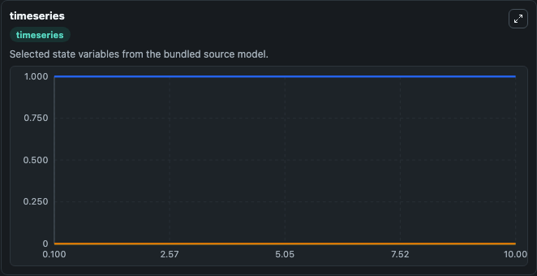
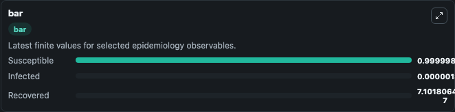
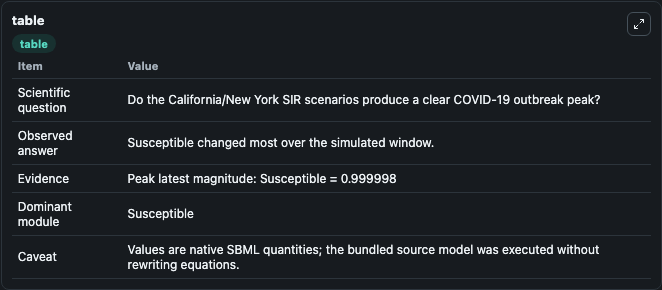

# Bertozzi2020 - SIR model of scenarios of COVID-19 spread in CA and NY

This Biosimulant lab wraps `Bertozzi2020 - SIR model of scenarios of COVID-19 spread in CA and NY` as a runnable epidemiology model with a companion visualization module.
The coronavirus disease 2019 (COVID-19) pandemic placed epidemic modeling at the center of public policy, and this lab exposes the curated SIR scenario model for interactive Biosimulant runs.

## What You'll See

The lab asks: Do the California/New York SIR scenarios produce a clear COVID-19 outbreak peak? It runs for 10.0 time units with a communication step of 0.1. The run uses the model defaults declared by the curated SBML wrapper. The generated visualizations focus on Infected, Susceptible, and Recovered, combining trajectory, endpoint-comparison, and summary-table views from one completed dark-mode run.

<!-- BIOSIMULANT_VISUALS_START -->
### Output Visualizations



*Time-series view for Bertozzi2020 - SIR model of scenarios of COVID-19 spread in CA and NY, showing selected epidemiology state trajectories across the 10.0 simulation. The card is useful for reading peak timing, depletion, recovery, and persistence across Infected, Susceptible, and Recovered.*



*Latest-value comparison for Bertozzi2020 - SIR model of scenarios of COVID-19 spread in CA and NY, ranking the finite end-of-run values for the selected epidemiology observables. This makes the dominant compartments and residual states easier to compare at the simulation endpoint.*



*Summary table for Bertozzi2020 - SIR model of scenarios of COVID-19 spread in CA and NY, collecting the run diagnostics reported by the visualization model, including duration simulated, observable coverage, largest change, and peak observable when available.*

<!-- BIOSIMULANT_VISUALS_END -->

## Model Context

- Core model: `models/core`
- Visualization model: `models/visualisation`
- Standard: `sbml`
- Upstream source: `biomodels_ebi:BIOMD0000000956`
- License: `CC0`

## Inputs

| Input | Maps To | Notes |
|---|---|---|
| Reproduction Number | `epidemiology_sbml_bertozzi2020_sir_model_of_scenarios_of_covid_19_biomd0000000956_model.reproduction_number` | Uses the model default unless overridden at run time. |
| Recovery Rate | `epidemiology_sbml_bertozzi2020_sir_model_of_scenarios_of_covid_19_biomd0000000956_model.recovery_rate` | Uses the model default unless overridden at run time. |

## Outputs

| Output | Maps To | Role |
|---|---|---|
| Model state | `state` | Available to the visualization model and downstream workflows. |
| Simulation summary | `summary` | Available to the visualization model and downstream workflows. |
| Species labels | `species_labels` | Available to the visualization model and downstream workflows. |
| Infected | `Infected` | Available to the visualization model and downstream workflows. |
| Susceptible | `Susceptible` | Available to the visualization model and downstream workflows. |
| Recovered | `Recovered` | Available to the visualization model and downstream workflows. |

## Runtime

- Duration: `10.0`
- Communication step: `0.1`
- Capture run ID: `70fe6773-666a-49fd-bb72-f103c72ce1a2`

## Running Locally

```bash
biosimulant labs serve .
```
