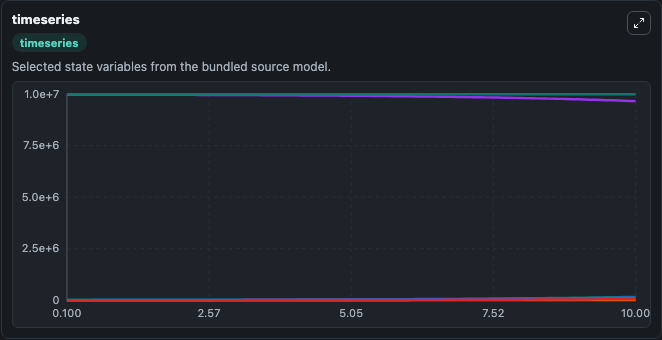
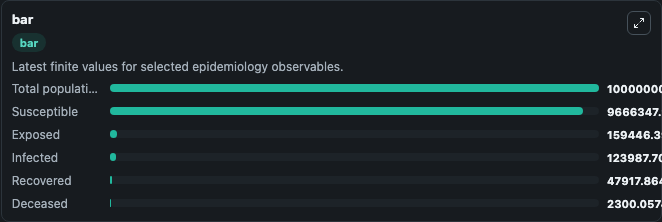
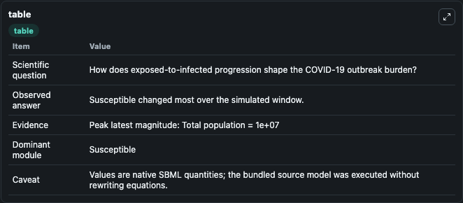

# Carcione2020 - Deterministic SEIR simulation of a COVID-19 outbreak

This Biosimulant lab wraps `Carcione2020 - Deterministic SEIR simulation of a COVID-19 outbreak` as a runnable epidemiology model with a companion visualization module.
An epidemic disease caused by a new coronavirus has spread in Northern Italy with a strong contagion rate. It can be used to explore transmission dynamics and compare scenario outcomes across conditions.

## What You'll See

The lab asks: How does exposed-to-infected progression shape the COVID-19 outbreak burden? It runs for 10.0 time units with a communication step of 0.1. The run uses the model defaults declared by the curated SBML wrapper. The generated visualizations focus on Exposed, Infected, Deceased, Susceptible, Recovered, and Total population, combining trajectory, endpoint-comparison, and summary-table views from one completed dark-mode run.

<!-- BIOSIMULANT_VISUALS_START -->
### Output Visualizations



*Time-series view for Carcione2020 - Deterministic SEIR simulation of a COVID-19 outbreak, showing selected epidemiology state trajectories across the 10.0 simulation. The card is useful for reading peak timing, depletion, recovery, and persistence across Exposed, Infected, Deceased, Susceptible, Recovered, and Total population.*



*Latest-value comparison for Carcione2020 - Deterministic SEIR simulation of a COVID-19 outbreak, ranking the finite end-of-run values for the selected epidemiology observables. This makes the dominant compartments and residual states easier to compare at the simulation endpoint.*



*Summary table for Carcione2020 - Deterministic SEIR simulation of a COVID-19 outbreak, collecting the run diagnostics reported by the visualization model, including duration simulated, observable coverage, largest change, and peak observable when available.*

<!-- BIOSIMULANT_VISUALS_END -->

## Model Context

- Core model: `models/core`
- Visualization model: `models/visualisation`
- Standard: `sbml`
- Upstream source: `biomodels_ebi:BIOMD0000000974`
- License: `CC0`

## Inputs

| Input | Maps To | Notes |
|---|---|---|
| Transmission Rate | `epidemiology_sbml_carcione2020_deterministic_seir_simulation_of_a_biomd0000000974_model.transmission_rate` | Uses the model default unless overridden at run time. |
| Recovery Rate | `epidemiology_sbml_carcione2020_deterministic_seir_simulation_of_a_biomd0000000974_model.recovery_rate` | Uses the model default unless overridden at run time. |
| Incubation Rate | `epidemiology_sbml_carcione2020_deterministic_seir_simulation_of_a_biomd0000000974_model.incubation_rate` | Uses the model default unless overridden at run time. |

## Outputs

| Output | Maps To | Role |
|---|---|---|
| Model state | `state` | Available to the visualization model and downstream workflows. |
| Simulation summary | `summary` | Available to the visualization model and downstream workflows. |
| Species labels | `species_labels` | Available to the visualization model and downstream workflows. |
| Exposed | `Exposed` | Available to the visualization model and downstream workflows. |
| Infected | `Infected` | Available to the visualization model and downstream workflows. |
| Deceased | `Deceased` | Available to the visualization model and downstream workflows. |
| Susceptible | `Susceptible` | Available to the visualization model and downstream workflows. |
| Recovered | `Recovered` | Available to the visualization model and downstream workflows. |
| Total population | `Total_population` | Available to the visualization model and downstream workflows. |

## Runtime

- Duration: `10.0`
- Communication step: `0.1`
- Capture run ID: `7bc12065-fe20-4f83-9790-7e0e1cc82c66`

## Running Locally

```bash
biosimulant labs serve .
```
