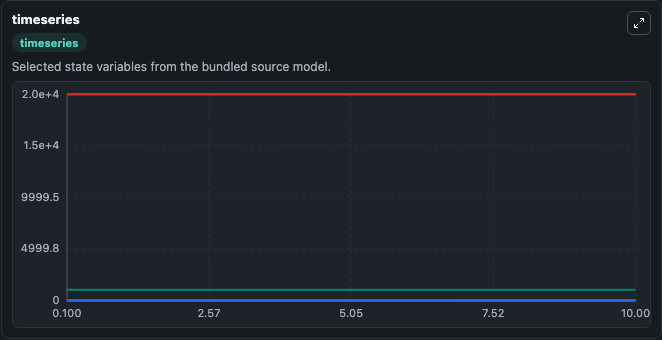
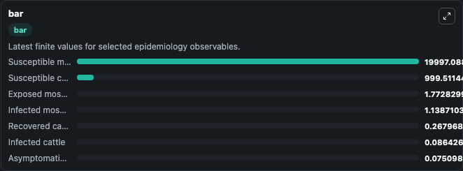
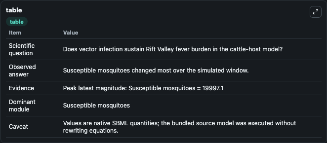

# Chitnis2012 - Model Rift Valley Fever transmission between cattle and mosquitoes (Model 1)

This Biosimulant lab wraps `Chitnis2012 - Model Rift Valley Fever transmission between cattle and mosquitoes (Model 1)` as a runnable epidemiology model with a companion visualization module.
Mathematical model for Rift Valley Fever transmission between cattle and mosquitoes without infectious eggs. It can be used to explore transmission dynamics and compare scenario outcomes across conditions.

## What You'll See

The lab asks: Does vector infection sustain Rift Valley fever burden in the cattle-host model? It runs for 10.0 time units with a communication step of 0.1. The run uses the model defaults declared by the curated SBML wrapper. The generated visualizations focus on Susceptible cattle, Asymptomatic cattle, Infected cattle, Recovered cattle, Susceptible mosquitoes, and Exposed mosquitoes, and related outputs, combining trajectory, endpoint-comparison, and summary-table views from one completed dark-mode run.

<!-- BIOSIMULANT_VISUALS_START -->
### Output Visualizations



*Time-series view for Chitnis2012 - Model Rift Valley Fever transmission between cattle and mosquitoes (Model 1), showing selected epidemiology state trajectories across the 10.0 simulation. The card is useful for reading peak timing, depletion, recovery, and persistence across Susceptible cattle, Asymptomatic cattle, Infected cattle, Recovered cattle, Susceptible mosquitoes, and Exposed mosquitoes, and related outputs.*



*Latest-value comparison for Chitnis2012 - Model Rift Valley Fever transmission between cattle and mosquitoes (Model 1), ranking the finite end-of-run values for the selected epidemiology observables. This makes the dominant compartments and residual states easier to compare at the simulation endpoint.*



*Summary table for Chitnis2012 - Model Rift Valley Fever transmission between cattle and mosquitoes (Model 1), collecting the run diagnostics reported by the visualization model, including duration simulated, observable coverage, largest change, and peak observable when available.*

<!-- BIOSIMULANT_VISUALS_END -->

## Model Context

- Core model: `models/core`
- Visualization model: `models/visualisation`
- Standard: `sbml`
- Upstream source: `biomodels_ebi:BIOMD0000000950`
- License: `CC0`

## Inputs

| Input | Maps To | Notes |
|---|---|---|
| Cattle To Mosquito Transmission | `epidemiology_sbml_chitnis2012_model_rift_valley_fever_transmission_biomd0000000950_model.cattle_to_mosquito_transmission` | Uses the model default unless overridden at run time. |
| Mosquito To Cattle Transmission | `epidemiology_sbml_chitnis2012_model_rift_valley_fever_transmission_biomd0000000950_model.mosquito_to_cattle_transmission` | Uses the model default unless overridden at run time. |
| Cattle Recovery Rate | `epidemiology_sbml_chitnis2012_model_rift_valley_fever_transmission_biomd0000000950_model.cattle_recovery_rate` | Uses the model default unless overridden at run time. |
| Mosquito Birth Rate | `epidemiology_sbml_chitnis2012_model_rift_valley_fever_transmission_biomd0000000950_model.mosquito_birth_rate` | Uses the model default unless overridden at run time. |
| Mosquito Mortality Rate | `epidemiology_sbml_chitnis2012_model_rift_valley_fever_transmission_biomd0000000950_model.mosquito_mortality_rate` | Uses the model default unless overridden at run time. |

## Outputs

| Output | Maps To | Role |
|---|---|---|
| Model state | `state` | Available to the visualization model and downstream workflows. |
| Simulation summary | `summary` | Available to the visualization model and downstream workflows. |
| Species labels | `species_labels` | Available to the visualization model and downstream workflows. |
| Susceptible cattle | `S_h` | Available to the visualization model and downstream workflows. |
| Asymptomatic cattle | `A_h` | Available to the visualization model and downstream workflows. |
| Infected cattle | `I_h` | Available to the visualization model and downstream workflows. |
| Recovered cattle | `R_h` | Available to the visualization model and downstream workflows. |
| Susceptible mosquitoes | `S_v` | Available to the visualization model and downstream workflows. |
| Exposed mosquitoes | `E_v` | Available to the visualization model and downstream workflows. |
| Infected mosquitoes | `I_v` | Available to the visualization model and downstream workflows. |

## Runtime

- Duration: `10.0`
- Communication step: `0.1`
- Capture run ID: `8ba68250-3765-4f2f-bcee-d0e1c0feffbd`

## Running Locally

```bash
biosimulant labs serve .
```
