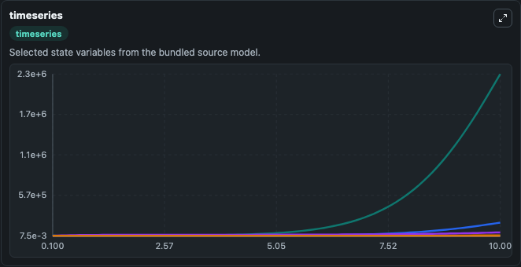
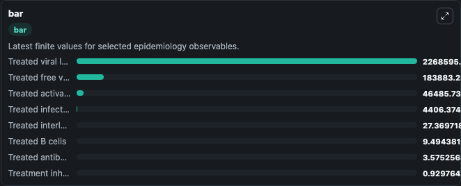
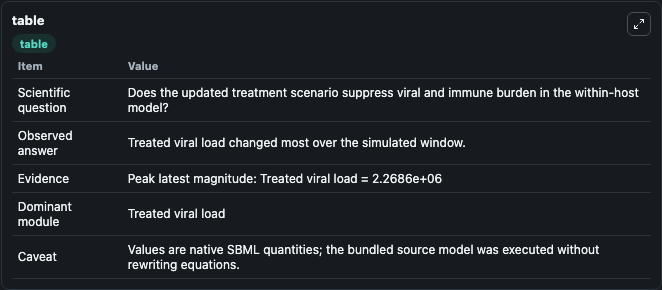

# COVID-19 immunotherapy A mathematical model

This Biosimulant lab wraps `COVID-19 immunotherapy A mathematical model` as a runnable epidemiology model with a companion visualization module.
The pandemic caused by SARS-CoV-2 is responsible for terrible health devastation with profoundly harmful consequences for the economic, social and political activities of communities on a global scale. It can be used to explore transmission dynamics and compare scenario outcomes across conditions.

## What You'll See

The lab asks: Does the updated treatment scenario suppress viral and immune burden in the within-host model? It runs for 10.0 time units with a communication step of 0.1. The run uses the model defaults declared by the curated SBML wrapper. The generated visualizations focus on Treated viral load, Treated free virus, Treated infected epithelial cells, Treated activated neutrophils, Treated interleukin 12, and Treated antibody response, and related outputs, combining trajectory, endpoint-comparison, and summary-table views from one completed dark-mode run.

<!-- BIOSIMULANT_VISUALS_START -->
### Output Visualizations



*Time-series view for COVID-19 immunotherapy A mathematical model, showing selected epidemiology state trajectories across the 10.0 simulation. The card is useful for reading peak timing, depletion, recovery, and persistence across Treated viral load, Treated free virus, Treated infected epithelial cells, Treated activated neutrophils, Treated interleukin 12, and Treated antibody response, and related outputs.*



*Latest-value comparison for COVID-19 immunotherapy A mathematical model, ranking the finite end-of-run values for the selected epidemiology observables. This makes the dominant compartments and residual states easier to compare at the simulation endpoint.*



*Summary table for COVID-19 immunotherapy A mathematical model, collecting the run diagnostics reported by the visualization model, including duration simulated, observable coverage, largest change, and peak observable when available.*

<!-- BIOSIMULANT_VISUALS_END -->

## Model Context

- Core model: `models/core`
- Visualization model: `models/visualisation`
- Standard: `sbml`
- Upstream source: `biomodels_ebi:MODEL2202230002`
- License: `CC0`

## Inputs

| Input | Maps To | Notes |
|---|---|---|
| Virus Clearance Rate | `epidemiology_sbml_covid_19_immunotherapy_a_mathematical_model_model2202230002_model.virus_clearance_rate` | Uses the model default unless overridden at run time. |
| Virus Production Rate | `epidemiology_sbml_covid_19_immunotherapy_a_mathematical_model_model2202230002_model.virus_production_rate` | Uses the model default unless overridden at run time. |
| Infected Cell Death Rate | `epidemiology_sbml_covid_19_immunotherapy_a_mathematical_model_model2202230002_model.infected_cell_death_rate` | Uses the model default unless overridden at run time. |
| Immune Activation Rate | `epidemiology_sbml_covid_19_immunotherapy_a_mathematical_model_model2202230002_model.immune_activation_rate` | Uses the model default unless overridden at run time. |

## Outputs

| Output | Maps To | Role |
|---|---|---|
| Model state | `state` | Available to the visualization model and downstream workflows. |
| Simulation summary | `summary` | Available to the visualization model and downstream workflows. |
| Species labels | `species_labels` | Available to the visualization model and downstream workflows. |
| Treated viral load | `VL_tratamento` | Available to the visualization model and downstream workflows. |
| Treated free virus | `V_tratamento` | Available to the visualization model and downstream workflows. |
| Treated infected epithelial cells | `A_I_tratamento` | Available to the visualization model and downstream workflows. |
| Treated activated neutrophils | `N_at_tratamento` | Available to the visualization model and downstream workflows. |
| Treated interleukin 12 | `I_12_tratamento` | Available to the visualization model and downstream workflows. |
| Treated antibody response | `I_ab_tratamento` | Available to the visualization model and downstream workflows. |
| Treated B cells | `B_tratamento` | Available to the visualization model and downstream workflows. |
| Treatment inhibition signal | `Inib_tratamento` | Available to the visualization model and downstream workflows. |

## Runtime

- Duration: `10.0`
- Communication step: `0.1`
- Capture run ID: `c33ffc93-b69e-4fa4-bf6b-d410b8eb353a`

## Running Locally

```bash
biosimulant labs serve .
```
