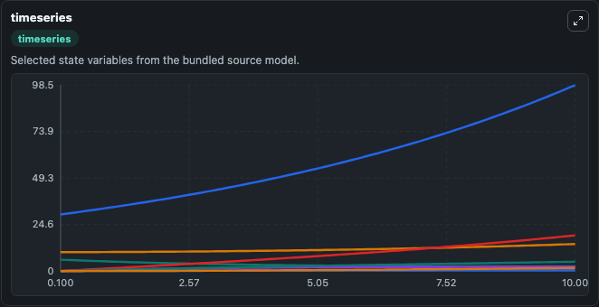
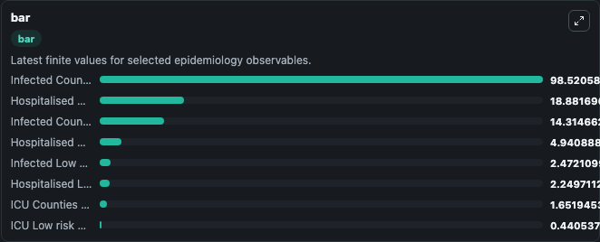
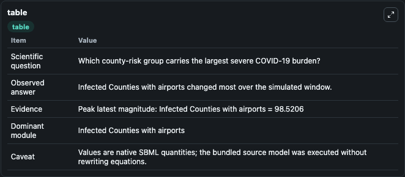

# Cuadros2020 - SIHRD spatiotemporal model of COVID-19 transmission in Ohio

This Biosimulant lab wraps `Cuadros2020 - SIHRD spatiotemporal model of COVID-19 transmission in Ohio` as a runnable epidemiology model with a companion visualization module.
The role of geospatial disparities in the dynamics of the COVID-19 pandemic is poorly understood. We developed a spatially-explicit mathematical model to simulate transmission dynamics of COVID-19 dis.

## What You'll See

The lab asks: Which county-risk group carries the largest severe COVID-19 burden? It runs for 10.0 time units with a communication step of 0.1. The run uses the model defaults declared by the curated SBML wrapper. The generated visualizations focus on Infected Low risk counties, Infected Counties with airports, Infected Counties with highways, Hospitalised Low risk counties, Hospitalised Counties with airports, and Hospitalised Counties with highways, and related outputs, combining trajectory, endpoint-comparison, and summary-table views from one completed dark-mode run.

<!-- BIOSIMULANT_VISUALS_START -->
### Output Visualizations



*Time-series view for Cuadros2020 - SIHRD spatiotemporal model of COVID-19 transmission in Ohio, showing selected epidemiology state trajectories across the 10.0 simulation. The card is useful for reading peak timing, depletion, recovery, and persistence across Infected Low risk counties, Infected Counties with airports, Infected Counties with highways, Hospitalised Low risk counties, Hospitalised Counties with airports, and Hospitalised Counties with highways, and related outputs.*



*Latest-value comparison for Cuadros2020 - SIHRD spatiotemporal model of COVID-19 transmission in Ohio, ranking the finite end-of-run values for the selected epidemiology observables. This makes the dominant compartments and residual states easier to compare at the simulation endpoint.*



*Summary table for Cuadros2020 - SIHRD spatiotemporal model of COVID-19 transmission in Ohio, collecting the run diagnostics reported by the visualization model, including duration simulated, observable coverage, largest change, and peak observable when available.*

<!-- BIOSIMULANT_VISUALS_END -->

## Model Context

- Core model: `models/core`
- Visualization model: `models/visualisation`
- Standard: `sbml`
- Upstream source: `biomodels_ebi:BIOMD0000000969`
- License: `CC0`

## Inputs

| Input | Maps To | Notes |
|---|---|---|
| Airport County Transmission Rate | `epidemiology_sbml_cuadros2020_sihrd_spatiotemporal_model_of_covid_biomd0000000969_model.airport_county_transmission_rate` | Uses the model default unless overridden at run time. |
| Highway County Transmission Rate | `epidemiology_sbml_cuadros2020_sihrd_spatiotemporal_model_of_covid_biomd0000000969_model.highway_county_transmission_rate` | Uses the model default unless overridden at run time. |
| Low Risk County Transmission Rate | `epidemiology_sbml_cuadros2020_sihrd_spatiotemporal_model_of_covid_biomd0000000969_model.low_risk_county_transmission_rate` | Uses the model default unless overridden at run time. |
| Recovery Rate | `epidemiology_sbml_cuadros2020_sihrd_spatiotemporal_model_of_covid_biomd0000000969_model.recovery_rate` | Uses the model default unless overridden at run time. |
| Hospital To Icu Rate | `epidemiology_sbml_cuadros2020_sihrd_spatiotemporal_model_of_covid_biomd0000000969_model.hospital_to_icu_rate` | Uses the model default unless overridden at run time. |

## Outputs

| Output | Maps To | Role |
|---|---|---|
| Model state | `state` | Available to the visualization model and downstream workflows. |
| Simulation summary | `summary` | Available to the visualization model and downstream workflows. |
| Species labels | `species_labels` | Available to the visualization model and downstream workflows. |
| Infected Low risk counties | `Infected_Low_risk_counties` | Available to the visualization model and downstream workflows. |
| Infected Counties with airports | `Infected_Counties_with_airports` | Available to the visualization model and downstream workflows. |
| Infected Counties with highways | `Infected_Counties_with_highways` | Available to the visualization model and downstream workflows. |
| Hospitalised Low risk counties | `Hospitalised_Low_risk_counties` | Available to the visualization model and downstream workflows. |
| Hospitalised Counties with airports | `Hospitalised_Counties_with_airports` | Available to the visualization model and downstream workflows. |
| Hospitalised Counties with highways | `Hospitalised_Counties_with_highways` | Available to the visualization model and downstream workflows. |
| ICU Low risk counties | `ICU_Low_risk_counties` | Available to the visualization model and downstream workflows. |
| ICU Counties with airports | `ICU_Counties_with_airports` | Available to the visualization model and downstream workflows. |

## Runtime

- Duration: `10.0`
- Communication step: `0.1`
- Capture run ID: `a81915b8-32f4-40bc-85a6-01c3aa1fb73b`

## Running Locally

```bash
biosimulant labs serve .
```
