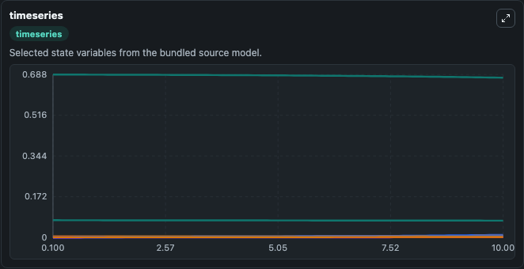
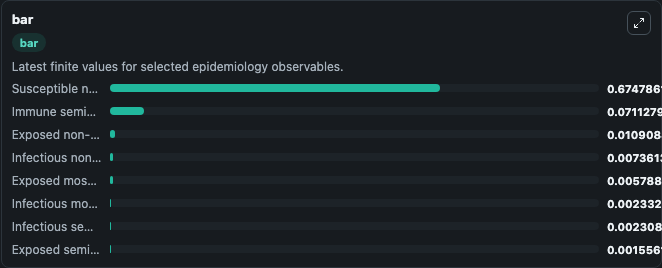
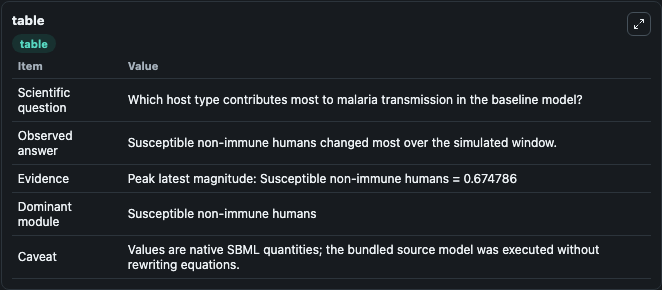

# Ducrot2009 - Malaria transmission in two host types

This Biosimulant lab wraps `Ducrot2009 - Malaria transmission in two host types` as a runnable epidemiology model with a companion visualization module.
The main purpose of this article is to formulate a deterministic mathematical model for the transmission of malaria that considers two host types in the human population. It can be used to explore transmission dynamics and compare scenario outcomes across conditions.

## What You'll See

The lab asks: Which host type contributes most to malaria transmission in the baseline model? It runs for 10.0 time units with a communication step of 0.1. The run uses the model defaults declared by the curated SBML wrapper. The generated visualizations focus on Susceptible non-immune humans, Exposed non-immune humans, Infectious non-immune humans, Exposed semi-immune humans, Infectious semi-immune humans, and Immune semi-immune humans, and related outputs, combining trajectory, endpoint-comparison, and summary-table views from one completed dark-mode run.

<!-- BIOSIMULANT_VISUALS_START -->
### Output Visualizations



*Time-series view for Ducrot2009 - Malaria transmission in two host types, showing selected epidemiology state trajectories across the 10.0 simulation. The card is useful for reading peak timing, depletion, recovery, and persistence across Susceptible non-immune humans, Exposed non-immune humans, Infectious non-immune humans, Exposed semi-immune humans, Infectious semi-immune humans, and Immune semi-immune humans, and related outputs.*



*Latest-value comparison for Ducrot2009 - Malaria transmission in two host types, ranking the finite end-of-run values for the selected epidemiology observables. This makes the dominant compartments and residual states easier to compare at the simulation endpoint.*



*Summary table for Ducrot2009 - Malaria transmission in two host types, collecting the run diagnostics reported by the visualization model, including duration simulated, observable coverage, largest change, and peak observable when available.*

<!-- BIOSIMULANT_VISUALS_END -->

## Model Context

- Core model: `models/core`
- Visualization model: `models/visualisation`
- Standard: `sbml`
- Upstream source: `biomodels_ebi:MODEL1808280013`
- License: `CC0`

## Inputs

| Input | Maps To | Notes |
|---|---|---|
| Mosquito To Nonimmune Transmission | `epidemiology_sbml_ducrot2009_malaria_transmission_in_two_host_type_model1808280013_model.mosquito_to_nonimmune_transmission` | Uses the model default unless overridden at run time. |
| Mosquito To Semi Immune Transmission | `epidemiology_sbml_ducrot2009_malaria_transmission_in_two_host_type_model1808280013_model.mosquito_to_semi_immune_transmission` | Uses the model default unless overridden at run time. |
| Nonimmune To Mosquito Transmission | `epidemiology_sbml_ducrot2009_malaria_transmission_in_two_host_type_model1808280013_model.nonimmune_to_mosquito_transmission` | Uses the model default unless overridden at run time. |
| Semi Immune To Mosquito Transmission | `epidemiology_sbml_ducrot2009_malaria_transmission_in_two_host_type_model1808280013_model.semi_immune_to_mosquito_transmission` | Uses the model default unless overridden at run time. |

## Outputs

| Output | Maps To | Role |
|---|---|---|
| Model state | `state` | Available to the visualization model and downstream workflows. |
| Simulation summary | `summary` | Available to the visualization model and downstream workflows. |
| Species labels | `species_labels` | Available to the visualization model and downstream workflows. |
| Susceptible non-immune humans | `s_e` | Available to the visualization model and downstream workflows. |
| Exposed non-immune humans | `e_e` | Available to the visualization model and downstream workflows. |
| Infectious non-immune humans | `i_e` | Available to the visualization model and downstream workflows. |
| Exposed semi-immune humans | `e_a` | Available to the visualization model and downstream workflows. |
| Infectious semi-immune humans | `i_a` | Available to the visualization model and downstream workflows. |
| Immune semi-immune humans | `r_a` | Available to the visualization model and downstream workflows. |
| Exposed mosquitoes | `e_v` | Available to the visualization model and downstream workflows. |
| Infectious mosquitoes | `i_v` | Available to the visualization model and downstream workflows. |

## Runtime

- Duration: `10.0`
- Communication step: `0.1`
- Capture run ID: `340a0fd6-c01c-4315-aa8a-b0184c961d82`

## Running Locally

```bash
biosimulant labs serve .
```
