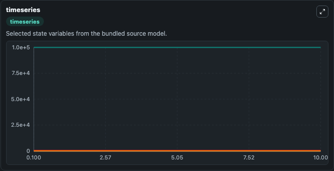
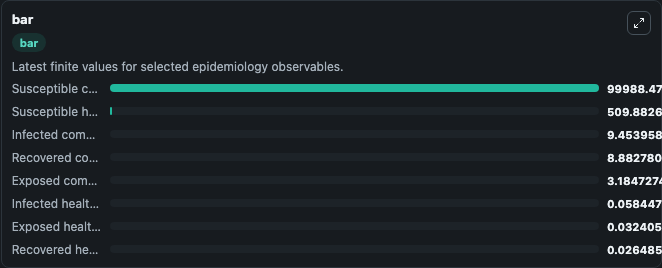
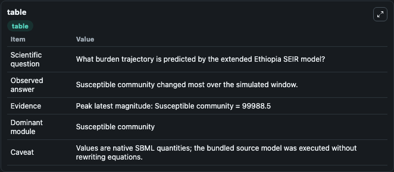

# Model-based prediction of SARS-CoV-2 in Ethiopia: Extended SEIR model

This Biosimulant lab wraps `Model-based prediction of SARS-CoV-2 in Ethiopia: Extended SEIR model` as a runnable epidemiology model with a companion visualization module.
One of three models used to describe dynamics of COVID-19 spread in Ethiopia. Here the two investigated population groups healthcare workers and community members are modeled as separate but interacti.

## What You'll See

The lab asks: What burden trajectory is predicted by the extended Ethiopia SEIR model? It runs for 10.0 time units with a communication step of 0.1. The run uses the model defaults declared by the curated SBML wrapper. The generated visualizations focus on Susceptible community, Exposed community, Infected community, Recovered community, Susceptible healthcare workers, and Exposed healthcare workers, and related outputs, combining trajectory, endpoint-comparison, and summary-table views from one completed dark-mode run.

<!-- BIOSIMULANT_VISUALS_START -->
### Output Visualizations



*Time-series view for Model-based prediction of SARS-CoV-2 in Ethiopia: Extended SEIR model, showing selected epidemiology state trajectories across the 10.0 simulation. The card is useful for reading peak timing, depletion, recovery, and persistence across Susceptible community, Exposed community, Infected community, Recovered community, Susceptible healthcare workers, and Exposed healthcare workers, and related outputs.*



*Latest-value comparison for Model-based prediction of SARS-CoV-2 in Ethiopia: Extended SEIR model, ranking the finite end-of-run values for the selected epidemiology observables. This makes the dominant compartments and residual states easier to compare at the simulation endpoint.*



*Summary table for Model-based prediction of SARS-CoV-2 in Ethiopia: Extended SEIR model, collecting the run diagnostics reported by the visualization model, including duration simulated, observable coverage, largest change, and peak observable when available.*

<!-- BIOSIMULANT_VISUALS_END -->

## Model Context

- Core model: `models/core`
- Visualization model: `models/visualisation`
- Standard: `sbml`
- Upstream source: `biomodels_ebi:MODEL2212310001`
- License: `CC0`

## Inputs

| Input | Maps To | Notes |
|---|---|---|
| Community Transmission Rate | `epidemiology_sbml_model_based_prediction_of_sars_cov_2_in_ethiopia_model2212310001_model.community_transmission_rate` | Uses the model default unless overridden at run time. |
| Incubation Period | `epidemiology_sbml_model_based_prediction_of_sars_cov_2_in_ethiopia_model2212310001_model.incubation_period` | Uses the model default unless overridden at run time. |
| Recovery Period | `epidemiology_sbml_model_based_prediction_of_sars_cov_2_in_ethiopia_model2212310001_model.recovery_period` | Uses the model default unless overridden at run time. |
| Initial Infected | `epidemiology_sbml_model_based_prediction_of_sars_cov_2_in_ethiopia_model2212310001_model.initial_infected` | Uses the model default unless overridden at run time. |

## Outputs

| Output | Maps To | Role |
|---|---|---|
| Model state | `state` | Available to the visualization model and downstream workflows. |
| Simulation summary | `summary` | Available to the visualization model and downstream workflows. |
| Species labels | `species_labels` | Available to the visualization model and downstream workflows. |
| Susceptible community | `Sus_com` | Available to the visualization model and downstream workflows. |
| Exposed community | `Exp_com` | Available to the visualization model and downstream workflows. |
| Infected community | `Infc_com` | Available to the visualization model and downstream workflows. |
| Recovered community | `Rec_com` | Available to the visualization model and downstream workflows. |
| Susceptible healthcare workers | `Sus_hcw` | Available to the visualization model and downstream workflows. |
| Exposed healthcare workers | `Exp_hcw` | Available to the visualization model and downstream workflows. |
| Infected healthcare workers | `Infc_hcw` | Available to the visualization model and downstream workflows. |
| Recovered healthcare workers | `Rec_hcw` | Available to the visualization model and downstream workflows. |

## Runtime

- Duration: `10.0`
- Communication step: `0.1`
- Capture run ID: `90dbe762-529f-42b3-acd2-d485f2b7404d`

## Running Locally

```bash
biosimulant labs serve .
```
