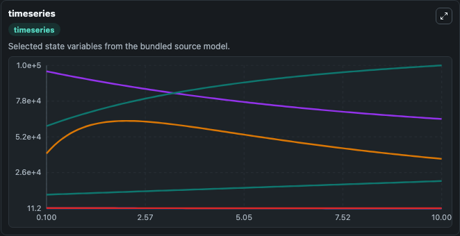
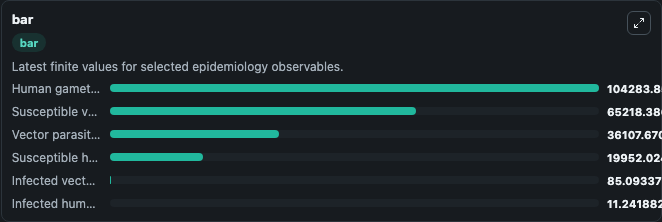
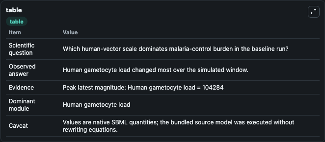

# Garira2019 - A coupled multiscale model to guide malaria control and elimination

This Biosimulant lab wraps `Garira2019 - A coupled multiscale model to guide malaria control and elimination` as a runnable epidemiology model with a companion visualization module.
This is a coupled multiscale mathematical model of malaria control and elimination containing four submodels: mosquito-to-human transmission of the malaria parasite, human-to-mosquito transmission of. It can be used to explore transmission dynamics and compare scenario outcomes across conditions.

## What You'll See

The lab asks: Which human-vector scale dominates malaria-control burden in the baseline run? It runs for 10.0 time units with a communication step of 0.1. The run uses the model defaults declared by the curated SBML wrapper. The generated visualizations focus on Susceptible humans, Infected humans, Vector parasite load, Susceptible vectors, Infected vectors, and Human gametocyte load, combining trajectory, endpoint-comparison, and summary-table views from one completed dark-mode run.

<!-- BIOSIMULANT_VISUALS_START -->
### Output Visualizations



*Time-series view for Garira2019 - A coupled multiscale model to guide malaria control and elimination, showing selected epidemiology state trajectories across the 10.0 simulation. The card is useful for reading peak timing, depletion, recovery, and persistence across Susceptible humans, Infected humans, Vector parasite load, Susceptible vectors, Infected vectors, and Human gametocyte load.*



*Latest-value comparison for Garira2019 - A coupled multiscale model to guide malaria control and elimination, ranking the finite end-of-run values for the selected epidemiology observables. This makes the dominant compartments and residual states easier to compare at the simulation endpoint.*



*Summary table for Garira2019 - A coupled multiscale model to guide malaria control and elimination, collecting the run diagnostics reported by the visualization model, including duration simulated, observable coverage, largest change, and peak observable when available.*

<!-- BIOSIMULANT_VISUALS_END -->

## Model Context

- Core model: `models/core`
- Visualization model: `models/visualisation`
- Standard: `sbml`
- Upstream source: `biomodels_ebi:MODEL2003190008`
- License: `CC0`

## Inputs

| Input | Maps To | Notes |
|---|---|---|
| Mosquito To Human Transmission | `epidemiology_sbml_garira2019_a_coupled_multiscale_model_to_guide_m_model2003190008_model.mosquito_to_human_transmission` | Uses the model default unless overridden at run time. |
| Human To Mosquito Transmission | `epidemiology_sbml_garira2019_a_coupled_multiscale_model_to_guide_m_model2003190008_model.human_to_mosquito_transmission` | Uses the model default unless overridden at run time. |
| Human Recovery Rate | `epidemiology_sbml_garira2019_a_coupled_multiscale_model_to_guide_m_model2003190008_model.human_recovery_rate` | Uses the model default unless overridden at run time. |
| Mosquito Mortality Rate | `epidemiology_sbml_garira2019_a_coupled_multiscale_model_to_guide_m_model2003190008_model.mosquito_mortality_rate` | Uses the model default unless overridden at run time. |
| Gametocyte Production Rate | `epidemiology_sbml_garira2019_a_coupled_multiscale_model_to_guide_m_model2003190008_model.gametocyte_production_rate` | Uses the model default unless overridden at run time. |

## Outputs

| Output | Maps To | Role |
|---|---|---|
| Model state | `state` | Available to the visualization model and downstream workflows. |
| Simulation summary | `summary` | Available to the visualization model and downstream workflows. |
| Species labels | `species_labels` | Available to the visualization model and downstream workflows. |
| Susceptible humans | `S_H` | Available to the visualization model and downstream workflows. |
| Infected humans | `I_H` | Available to the visualization model and downstream workflows. |
| Vector parasite load | `P_V` | Available to the visualization model and downstream workflows. |
| Susceptible vectors | `S_V` | Available to the visualization model and downstream workflows. |
| Infected vectors | `I_V` | Available to the visualization model and downstream workflows. |
| Human gametocyte load | `G_H` | Available to the visualization model and downstream workflows. |

## Runtime

- Duration: `10.0`
- Communication step: `0.1`
- Capture run ID: `772c90e8-3c35-4639-a1c9-ccd87bd85f0c`

## Running Locally

```bash
biosimulant labs serve .
```
