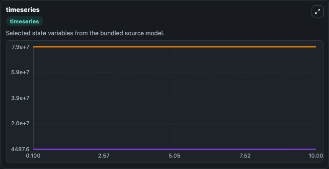
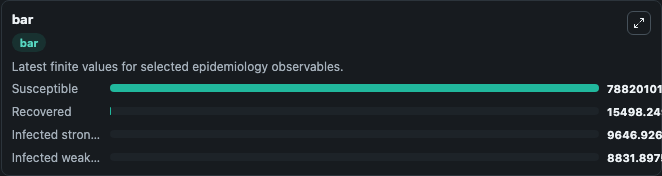
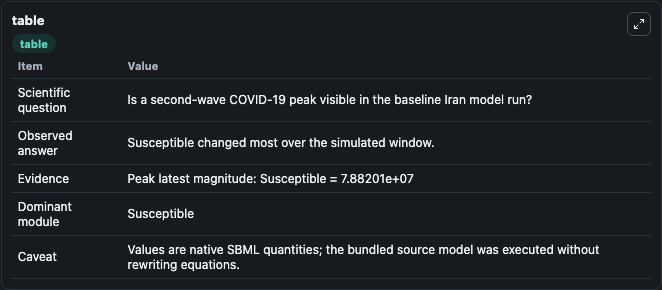

# Ghanbari2020 - forecasting the second wave of COVID-19 in Iran

This Biosimulant lab wraps `Ghanbari2020 - forecasting the second wave of COVID-19 in Iran` as a runnable epidemiology model with a companion visualization module.
One of the common misconceptions about COVID-19 disease is to assume that we will not see a recurrence after the first wave of the disease has subsided. It can be used to explore transmission dynamics and compare scenario outcomes across conditions.

## What You'll See

The lab asks: Is a second-wave COVID-19 peak visible in the baseline Iran model run? It runs for 10.0 time units with a communication step of 0.1. The run uses the model defaults declared by the curated SBML wrapper. The generated visualizations focus on Infected weak immune system, Infected strong immune system, Susceptible, and Recovered, combining trajectory, endpoint-comparison, and summary-table views from one completed dark-mode run.

<!-- BIOSIMULANT_VISUALS_START -->
### Output Visualizations



*Time-series view for Ghanbari2020 - forecasting the second wave of COVID-19 in Iran, showing selected epidemiology state trajectories across the 10.0 simulation. The card is useful for reading peak timing, depletion, recovery, and persistence across Infected weak immune system, Infected strong immune system, Susceptible, and Recovered.*



*Latest-value comparison for Ghanbari2020 - forecasting the second wave of COVID-19 in Iran, ranking the finite end-of-run values for the selected epidemiology observables. This makes the dominant compartments and residual states easier to compare at the simulation endpoint.*



*Summary table for Ghanbari2020 - forecasting the second wave of COVID-19 in Iran, collecting the run diagnostics reported by the visualization model, including duration simulated, observable coverage, largest change, and peak observable when available.*

<!-- BIOSIMULANT_VISUALS_END -->

## Model Context

- Core model: `models/core`
- Visualization model: `models/visualisation`
- Standard: `sbml`
- Upstream source: `biomodels_ebi:BIOMD0000000976`
- License: `CC0`

## Inputs

| Input | Maps To | Notes |
|---|---|---|
| Transmission Rate | `epidemiology_sbml_ghanbari2020_forecasting_the_second_wave_of_covi_biomd0000000976_model.transmission_rate` | Uses the model default unless overridden at run time. |
| Weak Immunity Recovery Rate | `epidemiology_sbml_ghanbari2020_forecasting_the_second_wave_of_covi_biomd0000000976_model.weak_immunity_recovery_rate` | Uses the model default unless overridden at run time. |
| Strong Immunity Recovery Rate | `epidemiology_sbml_ghanbari2020_forecasting_the_second_wave_of_covi_biomd0000000976_model.strong_immunity_recovery_rate` | Uses the model default unless overridden at run time. |
| Lockdown Start Day | `epidemiology_sbml_ghanbari2020_forecasting_the_second_wave_of_covi_biomd0000000976_model.lockdown_start_day` | Uses the model default unless overridden at run time. |
| Lockdown End Day | `epidemiology_sbml_ghanbari2020_forecasting_the_second_wave_of_covi_biomd0000000976_model.lockdown_end_day` | Uses the model default unless overridden at run time. |

## Outputs

| Output | Maps To | Role |
|---|---|---|
| Model state | `state` | Available to the visualization model and downstream workflows. |
| Simulation summary | `summary` | Available to the visualization model and downstream workflows. |
| Species labels | `species_labels` | Available to the visualization model and downstream workflows. |
| Infected weak immune system | `Infected_weak_immune_system` | Available to the visualization model and downstream workflows. |
| Infected strong immune system | `Infected_strong_immune_system` | Available to the visualization model and downstream workflows. |
| Susceptible | `Susceptible` | Available to the visualization model and downstream workflows. |
| Recovered | `Recovered` | Available to the visualization model and downstream workflows. |

## Runtime

- Duration: `10.0`
- Communication step: `0.1`
- Capture run ID: `aa065e80-820a-45c6-b3ba-177ec3ceb562`

## Running Locally

```bash
biosimulant labs serve .
```
