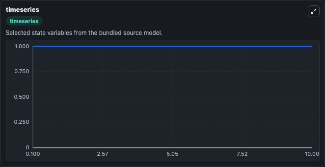
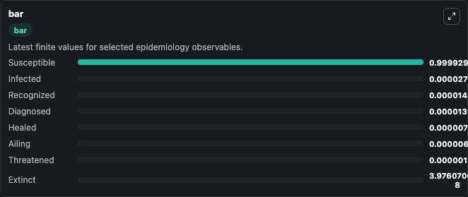
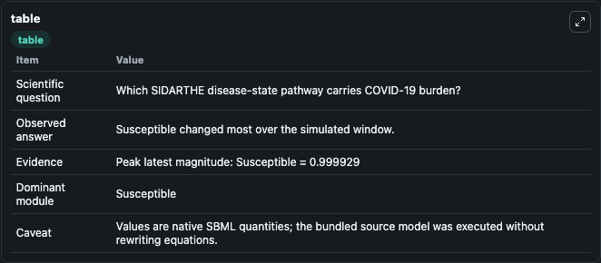

# Giordano2020 - SIDARTHE model of COVID-19 spread in Italy

This Biosimulant lab wraps `Giordano2020 - SIDARTHE model of COVID-19 spread in Italy` as a runnable epidemiology model with a companion visualization module.
In Italy, 128,948 confirmed cases and 15,887 deaths of people who tested positive for SARS-CoV-2 were registered as of 5 April 2020. Ending the global SARS-CoV-2 pandemic requires implementation of mu.

## What You'll See

The lab asks: Which SIDARTHE disease-state pathway carries COVID-19 burden? It runs for 10.0 time units with a communication step of 0.1. The run uses the model defaults declared by the curated SBML wrapper. The generated visualizations focus on Infected, Susceptible, Diagnosed, Ailing, Recognized, and Threatened, and related outputs, combining trajectory, endpoint-comparison, and summary-table views from one completed dark-mode run.

<!-- BIOSIMULANT_VISUALS_START -->
### Output Visualizations



*Time-series view for Giordano2020 - SIDARTHE model of COVID-19 spread in Italy, showing selected epidemiology state trajectories across the 10.0 simulation. The card is useful for reading peak timing, depletion, recovery, and persistence across Infected, Susceptible, Diagnosed, Ailing, Recognized, and Threatened, and related outputs.*



*Latest-value comparison for Giordano2020 - SIDARTHE model of COVID-19 spread in Italy, ranking the finite end-of-run values for the selected epidemiology observables. This makes the dominant compartments and residual states easier to compare at the simulation endpoint.*



*Summary table for Giordano2020 - SIDARTHE model of COVID-19 spread in Italy, collecting the run diagnostics reported by the visualization model, including duration simulated, observable coverage, largest change, and peak observable when available.*

<!-- BIOSIMULANT_VISUALS_END -->

## Model Context

- Core model: `models/core`
- Visualization model: `models/visualisation`
- Standard: `sbml`
- Upstream source: `biomodels_ebi:BIOMD0000000955`
- License: `CC0`

## Inputs

| Input | Maps To | Notes |
|---|---|---|
| Undetected Transmission Rate | `epidemiology_sbml_giordano2020_sidarthe_model_of_covid_19_spread_i_biomd0000000955_model.undetected_transmission_rate` | Uses the model default unless overridden at run time. |
| Diagnosed Transmission Rate | `epidemiology_sbml_giordano2020_sidarthe_model_of_covid_19_spread_i_biomd0000000955_model.diagnosed_transmission_rate` | Uses the model default unless overridden at run time. |
| Ailing Transmission Rate | `epidemiology_sbml_giordano2020_sidarthe_model_of_covid_19_spread_i_biomd0000000955_model.ailing_transmission_rate` | Uses the model default unless overridden at run time. |
| Recognition Rate | `epidemiology_sbml_giordano2020_sidarthe_model_of_covid_19_spread_i_biomd0000000955_model.recognition_rate` | Uses the model default unless overridden at run time. |
| Severe Progression Rate | `epidemiology_sbml_giordano2020_sidarthe_model_of_covid_19_spread_i_biomd0000000955_model.severe_progression_rate` | Uses the model default unless overridden at run time. |
| Healing Rate | `epidemiology_sbml_giordano2020_sidarthe_model_of_covid_19_spread_i_biomd0000000955_model.healing_rate` | Uses the model default unless overridden at run time. |

## Outputs

| Output | Maps To | Role |
|---|---|---|
| Model state | `state` | Available to the visualization model and downstream workflows. |
| Simulation summary | `summary` | Available to the visualization model and downstream workflows. |
| Species labels | `species_labels` | Available to the visualization model and downstream workflows. |
| Infected | `Infected` | Available to the visualization model and downstream workflows. |
| Susceptible | `Susceptible` | Available to the visualization model and downstream workflows. |
| Diagnosed | `Diagnosed` | Available to the visualization model and downstream workflows. |
| Ailing | `Ailing` | Available to the visualization model and downstream workflows. |
| Recognized | `Recognized` | Available to the visualization model and downstream workflows. |
| Threatened | `Threatened` | Available to the visualization model and downstream workflows. |
| Healed | `Healed` | Available to the visualization model and downstream workflows. |
| Extinct | `Extinct` | Available to the visualization model and downstream workflows. |

## Runtime

- Duration: `10.0`
- Communication step: `0.1`
- Capture run ID: `25e95bde-3b32-4eb8-b545-682c9a7da434`

## Running Locally

```bash
biosimulant labs serve .
```
