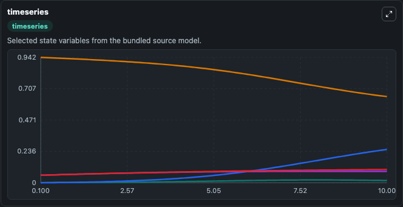
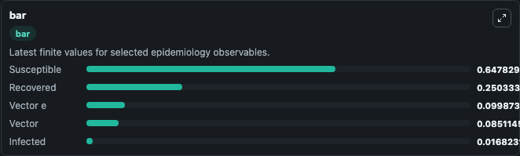
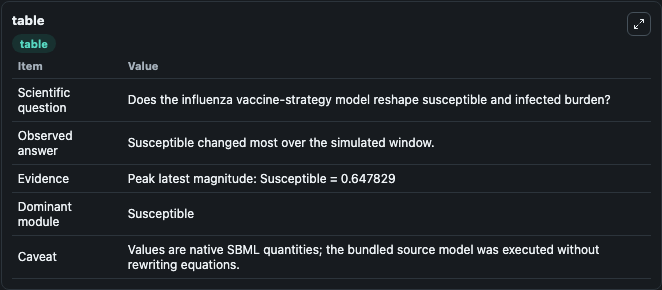

# Ho2019 - Mathematical models of transmission dynamics and vaccine strategies in Hong Kong during the 2017-2018 winter influenza season (Simple)

This Biosimulant lab wraps `Ho2019 - Mathematical models of transmission dynamics and vaccine strategies in Hong Kong during the 2017-2018 winter influenza season (Simple)` as a runnable epidemiology model with a companion visualization module.
This is the simple version of the two mathematical models presented by Ho et al. It is a model comprised of simple ordinary differential equations describing the overall epidemic dynamics of influenza.

## What You'll See

The lab asks: Does the influenza vaccine-strategy model reshape susceptible and infected burden? It runs for 10.0 time units with a communication step of 0.1. The run uses the model defaults declared by the curated SBML wrapper. The generated visualizations focus on Infected, Recovered, Susceptible, Vector, and Vector e, combining trajectory, endpoint-comparison, and summary-table views from one completed dark-mode run.

<!-- BIOSIMULANT_VISUALS_START -->
### Output Visualizations



*Time-series view for Ho2019 - Mathematical models of transmission dynamics and vaccine strategies in Hong Kong during the 2017-2018 winter influenza season (Simple), showing selected epidemiology state trajectories across the 10.0 simulation. The card is useful for reading peak timing, depletion, recovery, and persistence across Infected, Recovered, Susceptible, Vector, and Vector e.*



*Latest-value comparison for Ho2019 - Mathematical models of transmission dynamics and vaccine strategies in Hong Kong during the 2017-2018 winter influenza season (Simple), ranking the finite end-of-run values for the selected epidemiology observables. This makes the dominant compartments and residual states easier to compare at the simulation endpoint.*



*Summary table for Ho2019 - Mathematical models of transmission dynamics and vaccine strategies in Hong Kong during the 2017-2018 winter influenza season (Simple), collecting the run diagnostics reported by the visualization model, including duration simulated, observable coverage, largest change, and peak observable when available.*

<!-- BIOSIMULANT_VISUALS_END -->

## Model Context

- Core model: `models/core`
- Visualization model: `models/visualisation`
- Standard: `sbml`
- Upstream source: `biomodels_ebi:BIOMD0000000851`
- License: `CC0`

## Inputs

| Input | Maps To | Notes |
|---|---|---|
| Transmission Rate | `epidemiology_sbml_ho2019_mathematical_models_of_transmission_dynam_biomd0000000851_model.transmission_rate` | Uses the model default unless overridden at run time. |
| Recovery Rate | `epidemiology_sbml_ho2019_mathematical_models_of_transmission_dynam_biomd0000000851_model.recovery_rate` | Uses the model default unless overridden at run time. |

## Outputs

| Output | Maps To | Role |
|---|---|---|
| Model state | `state` | Available to the visualization model and downstream workflows. |
| Simulation summary | `summary` | Available to the visualization model and downstream workflows. |
| Species labels | `species_labels` | Available to the visualization model and downstream workflows. |
| Infected | `I` | Available to the visualization model and downstream workflows. |
| Recovered | `R` | Available to the visualization model and downstream workflows. |
| Susceptible | `S` | Available to the visualization model and downstream workflows. |
| Vector | `V` | Available to the visualization model and downstream workflows. |
| Vector e | `V_e` | Available to the visualization model and downstream workflows. |

## Runtime

- Duration: `10.0`
- Communication step: `0.1`
- Capture run ID: `6ac7728d-6198-41ee-8f42-e9e2b9be8433`

## Running Locally

```bash
biosimulant labs serve .
```
