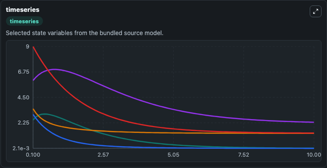
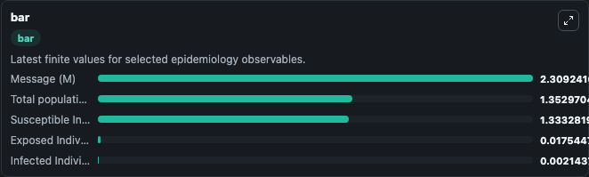
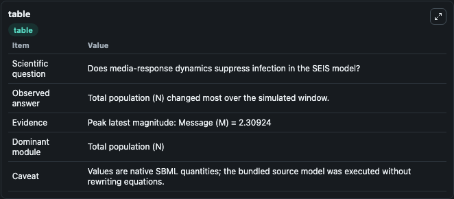

# Huo2017 - SEIS epidemic model with the impact of media

This Biosimulant lab wraps `Huo2017 - SEIS epidemic model with the impact of media` as a runnable epidemiology model with a companion visualization module.
Hai-Feng Huo, Peng Yang & Hong Xiang. Stability and bifurcation for an SEIS epidemic model with the impact of media.

## What You'll See

The lab asks: Does media-response dynamics suppress infection in the SEIS model? It runs for 10.0 time units with a communication step of 0.1. The run uses the model defaults declared by the curated SBML wrapper. The generated visualizations focus on Exposed Individuals (E), Infected Individuals (I), Susceptible Individuals (S), Message (M), and Total population (N), combining trajectory, endpoint-comparison, and summary-table views from one completed dark-mode run.

<!-- BIOSIMULANT_VISUALS_START -->
### Output Visualizations



*Time-series view for Huo2017 - SEIS epidemic model with the impact of media, showing selected epidemiology state trajectories across the 10.0 simulation. The card is useful for reading peak timing, depletion, recovery, and persistence across Exposed Individuals (E), Infected Individuals (I), Susceptible Individuals (S), Message (M), and Total population (N).*



*Latest-value comparison for Huo2017 - SEIS epidemic model with the impact of media, ranking the finite end-of-run values for the selected epidemiology observables. This makes the dominant compartments and residual states easier to compare at the simulation endpoint.*



*Summary table for Huo2017 - SEIS epidemic model with the impact of media, collecting the run diagnostics reported by the visualization model, including duration simulated, observable coverage, largest change, and peak observable when available.*

<!-- BIOSIMULANT_VISUALS_END -->

## Model Context

- Core model: `models/core`
- Visualization model: `models/visualisation`
- Standard: `sbml`
- Upstream source: `biomodels_ebi:BIOMD0000000715`
- License: `CC0`

## Inputs

| Input | Maps To | Notes |
|---|---|---|
| Transmission Rate | `epidemiology_sbml_huo2017_seis_epidemic_model_with_the_impact_of_m_biomd0000000715_model.transmission_rate` | Uses the model default unless overridden at run time. |
| Recovery Rate | `epidemiology_sbml_huo2017_seis_epidemic_model_with_the_impact_of_m_biomd0000000715_model.recovery_rate` | Uses the model default unless overridden at run time. |

## Outputs

| Output | Maps To | Role |
|---|---|---|
| Model state | `state` | Available to the visualization model and downstream workflows. |
| Simulation summary | `summary` | Available to the visualization model and downstream workflows. |
| Species labels | `species_labels` | Available to the visualization model and downstream workflows. |
| Exposed Individuals (E) | `E` | Available to the visualization model and downstream workflows. |
| Infected Individuals (I) | `I` | Available to the visualization model and downstream workflows. |
| Susceptible Individuals (S) | `S` | Available to the visualization model and downstream workflows. |
| Message (M) | `M` | Available to the visualization model and downstream workflows. |
| Total population (N) | `N` | Available to the visualization model and downstream workflows. |

## Runtime

- Duration: `10.0`
- Communication step: `0.1`
- Capture run ID: `4c3b08dd-c642-4ab0-a9a6-4336c4e94a5d`

## Running Locally

```bash
biosimulant labs serve .
```
