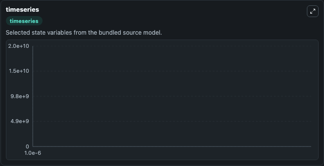
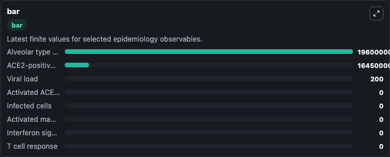
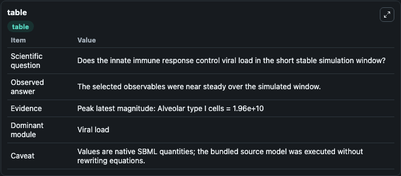

# Leander2021 - innate immune response to SARS-CoV-2 in the alveolar epithelium

This Biosimulant lab wraps `Leander2021 - innate immune response to SARS-CoV-2 in the alveolar epithelium` as a runnable epidemiology model with a companion visualization module.
A mathematical ODE based model of the innate immune response to SARS-CoV-2 in the alveolar epithelium. It can be used to explore transmission dynamics and compare scenario outcomes across conditions.

## What You'll See

The lab asks: Does the innate immune response control viral load in the short stable simulation window? It runs for 1.0e-06 time units with a communication step of 1.0e-06. The run uses the model defaults declared by the curated SBML wrapper. The generated visualizations focus on Viral load, Alveolar type I cells, ACE2-positive type II alveolar cells, Activated ACE2-positive type II alveolar cells, Infected cells, and Activated macrophages, and related outputs, combining trajectory, endpoint-comparison, and summary-table views from one completed dark-mode run.

<!-- BIOSIMULANT_VISUALS_START -->
### Output Visualizations



*Time-series view for Leander2021 - innate immune response to SARS-CoV-2 in the alveolar epithelium, showing selected epidemiology state trajectories across the 1.0e-06 simulation. The card is useful for reading peak timing, depletion, recovery, and persistence across Viral load, Alveolar type I cells, ACE2-positive type II alveolar cells, Activated ACE2-positive type II alveolar cells, Infected cells, and Activated macrophages, and related outputs.*



*Latest-value comparison for Leander2021 - innate immune response to SARS-CoV-2 in the alveolar epithelium, ranking the finite end-of-run values for the selected epidemiology observables. This makes the dominant compartments and residual states easier to compare at the simulation endpoint.*



*Summary table for Leander2021 - innate immune response to SARS-CoV-2 in the alveolar epithelium, collecting the run diagnostics reported by the visualization model, including duration simulated, observable coverage, largest change, and peak observable when available.*

<!-- BIOSIMULANT_VISUALS_END -->

## Model Context

- Core model: `models/core`
- Visualization model: `models/visualisation`
- Standard: `sbml`
- Upstream source: `biomodels_ebi:MODEL2111170001`
- License: `CC0`

## Inputs

| Input | Maps To | Notes |
|---|---|---|
| Viral Infection Rate | `epidemiology_sbml_leander2021_innate_immune_response_to_sars_cov_2_model2111170001_model.viral_infection_rate` | Uses the model default unless overridden at run time. |
| Virus Clearance Rate | `epidemiology_sbml_leander2021_innate_immune_response_to_sars_cov_2_model2111170001_model.virus_clearance_rate` | Uses the model default unless overridden at run time. |
| Viral Production Rate | `epidemiology_sbml_leander2021_innate_immune_response_to_sars_cov_2_model2111170001_model.viral_production_rate` | Uses the model default unless overridden at run time. |
| Macrophage Activation Rate | `epidemiology_sbml_leander2021_innate_immune_response_to_sars_cov_2_model2111170001_model.macrophage_activation_rate` | Uses the model default unless overridden at run time. |

## Outputs

| Output | Maps To | Role |
|---|---|---|
| Model state | `state` | Available to the visualization model and downstream workflows. |
| Simulation summary | `summary` | Available to the visualization model and downstream workflows. |
| Species labels | `species_labels` | Available to the visualization model and downstream workflows. |
| Viral load | `V` | Available to the visualization model and downstream workflows. |
| Alveolar type I cells | `A1` | Available to the visualization model and downstream workflows. |
| ACE2-positive type II alveolar cells | `A2` | Available to the visualization model and downstream workflows. |
| Activated ACE2-positive type II alveolar cells | `A2_act` | Available to the visualization model and downstream workflows. |
| Infected cells | `I` | Available to the visualization model and downstream workflows. |
| Activated macrophages | `M_act` | Available to the visualization model and downstream workflows. |
| Interferon signal | `F` | Available to the visualization model and downstream workflows. |
| T cell response | `T` | Available to the visualization model and downstream workflows. |
| Damaged cells | `D` | Available to the visualization model and downstream workflows. |

## Runtime

- Duration: `1.0e-06`
- Communication step: `1.0e-06`
- Capture run ID: `76f91917-c5b9-49e7-844f-2d24d6212e74`

## Running Locally

```bash
biosimulant labs serve .
```
