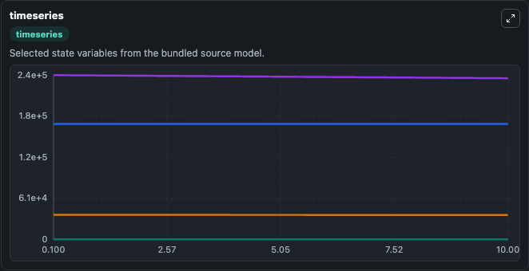
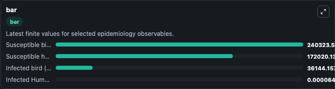
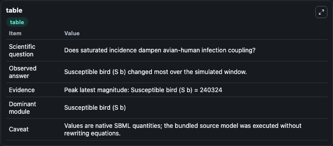

# Lee2018 - Avian human half-saturated incidence (HSI) model

This Biosimulant lab wraps `Lee2018 - Avian human half-saturated incidence (HSI) model` as a runnable epidemiology model with a companion visualization module.
Hanl Lee & Angelyn Lao. Transmission dynamics and control strategies assessment of avian influenza A (H5N6) in the Philippines.

## What You'll See

The lab asks: Does saturated incidence dampen avian-human infection coupling? It runs for 10.0 time units with a communication step of 0.1. The run uses the model defaults declared by the curated SBML wrapper. The generated visualizations focus on Infected Human (I a), Susceptible human (S h), Infected bird (I b), and Susceptible bird (S b), combining trajectory, endpoint-comparison, and summary-table views from one completed dark-mode run.

<!-- BIOSIMULANT_VISUALS_START -->
### Output Visualizations



*Time-series view for Lee2018 - Avian human half-saturated incidence (HSI) model, showing selected epidemiology state trajectories across the 10.0 simulation. The card is useful for reading peak timing, depletion, recovery, and persistence across Infected Human (I a), Susceptible human (S h), Infected bird (I b), and Susceptible bird (S b).*



*Latest-value comparison for Lee2018 - Avian human half-saturated incidence (HSI) model, ranking the finite end-of-run values for the selected epidemiology observables. This makes the dominant compartments and residual states easier to compare at the simulation endpoint.*



*Summary table for Lee2018 - Avian human half-saturated incidence (HSI) model, collecting the run diagnostics reported by the visualization model, including duration simulated, observable coverage, largest change, and peak observable when available.*

<!-- BIOSIMULANT_VISUALS_END -->

## Model Context

- Core model: `models/core`
- Visualization model: `models/visualisation`
- Standard: `sbml`
- Upstream source: `biomodels_ebi:BIOMD0000000717`
- License: `CC0`

## Inputs

| Input | Maps To | Notes |
|---|---|---|
| Bird To Human Transmission | `epidemiology_sbml_lee2018_avian_human_half_saturated_incidence_hsi_biomd0000000717_model.bird_to_human_transmission` | Uses the model default unless overridden at run time. |
| Bird To Bird Transmission | `epidemiology_sbml_lee2018_avian_human_half_saturated_incidence_hsi_biomd0000000717_model.bird_to_bird_transmission` | Uses the model default unless overridden at run time. |
| Environmental Transmission | `epidemiology_sbml_lee2018_avian_human_half_saturated_incidence_hsi_biomd0000000717_model.environmental_transmission` | Uses the model default unless overridden at run time. |
| Infected Bird Culling Rate | `epidemiology_sbml_lee2018_avian_human_half_saturated_incidence_hsi_biomd0000000717_model.infected_bird_culling_rate` | Uses the model default unless overridden at run time. |
| Human Quarantine Rate | `epidemiology_sbml_lee2018_avian_human_half_saturated_incidence_hsi_biomd0000000717_model.human_quarantine_rate` | Uses the model default unless overridden at run time. |

## Outputs

| Output | Maps To | Role |
|---|---|---|
| Model state | `state` | Available to the visualization model and downstream workflows. |
| Simulation summary | `summary` | Available to the visualization model and downstream workflows. |
| Species labels | `species_labels` | Available to the visualization model and downstream workflows. |
| Infected Human (I a) | `I_a` | Available to the visualization model and downstream workflows. |
| Susceptible human (S h) | `S_h` | Available to the visualization model and downstream workflows. |
| Infected bird (I b) | `I_b` | Available to the visualization model and downstream workflows. |
| Susceptible bird (S b) | `S_b` | Available to the visualization model and downstream workflows. |

## Runtime

- Duration: `10.0`
- Communication step: `0.1`
- Capture run ID: `37deecde-f6d9-4216-ada8-e31d478f4a08`

## Running Locally

```bash
biosimulant labs serve .
```
