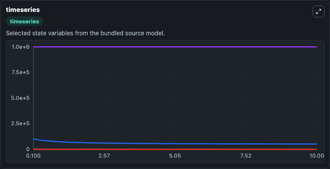
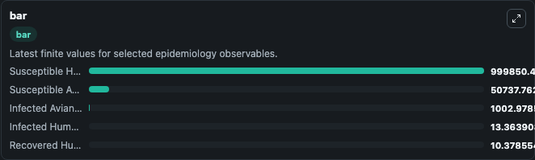
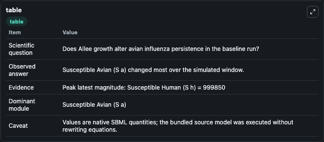

# Liu2017 - Dynamics of Avian Influenza with Allee Growth Effect

This Biosimulant lab wraps `Liu2017 - Dynamics of Avian Influenza with Allee Growth Effect` as a runnable epidemiology model with a companion visualization module.
Sanhong Liu, Shigui Ruan & Xinan Zhang. It can be used to explore transmission dynamics and compare scenario outcomes across conditions.

## What You'll See

The lab asks: Does Allee growth alter avian influenza persistence in the baseline run? It runs for 10.0 time units with a communication step of 0.1. The run uses the model defaults declared by the curated SBML wrapper. The generated visualizations focus on Infected Avian (I a), Susceptible Avian (S a), Infected Human (I h), Susceptible Human (S h), and Recovered Human (R h), combining trajectory, endpoint-comparison, and summary-table views from one completed dark-mode run.

<!-- BIOSIMULANT_VISUALS_START -->
### Output Visualizations



*Time-series view for Liu2017 - Dynamics of Avian Influenza with Allee Growth Effect, showing selected epidemiology state trajectories across the 10.0 simulation. The card is useful for reading peak timing, depletion, recovery, and persistence across Infected Avian (I a), Susceptible Avian (S a), Infected Human (I h), Susceptible Human (S h), and Recovered Human (R h).*



*Latest-value comparison for Liu2017 - Dynamics of Avian Influenza with Allee Growth Effect, ranking the finite end-of-run values for the selected epidemiology observables. This makes the dominant compartments and residual states easier to compare at the simulation endpoint.*



*Summary table for Liu2017 - Dynamics of Avian Influenza with Allee Growth Effect, collecting the run diagnostics reported by the visualization model, including duration simulated, observable coverage, largest change, and peak observable when available.*

<!-- BIOSIMULANT_VISUALS_END -->

## Model Context

- Core model: `models/core`
- Visualization model: `models/visualisation`
- Standard: `sbml`
- Upstream source: `biomodels_ebi:BIOMD0000000709`
- License: `CC0`

## Inputs

| Input | Maps To | Notes |
|---|---|---|
| Recovery Rate | `epidemiology_sbml_liu2017_dynamics_of_avian_influenza_with_allee_g_biomd0000000709_model.recovery_rate` | Uses the model default unless overridden at run time. |

## Outputs

| Output | Maps To | Role |
|---|---|---|
| Model state | `state` | Available to the visualization model and downstream workflows. |
| Simulation summary | `summary` | Available to the visualization model and downstream workflows. |
| Species labels | `species_labels` | Available to the visualization model and downstream workflows. |
| Infected Avian (I a) | `I_a` | Available to the visualization model and downstream workflows. |
| Susceptible Avian (S a) | `S_a` | Available to the visualization model and downstream workflows. |
| Infected Human (I h) | `I_h` | Available to the visualization model and downstream workflows. |
| Susceptible Human (S h) | `S_h` | Available to the visualization model and downstream workflows. |
| Recovered Human (R h) | `R_h` | Available to the visualization model and downstream workflows. |

## Runtime

- Duration: `10.0`
- Communication step: `0.1`
- Capture run ID: `3d4fef45-8d75-446e-9486-f74cc3fb9f56`

## Running Locally

```bash
biosimulant labs serve .
```
