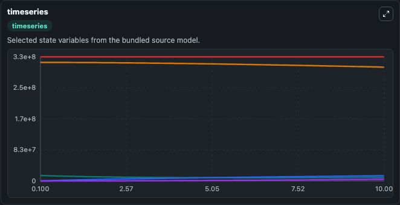
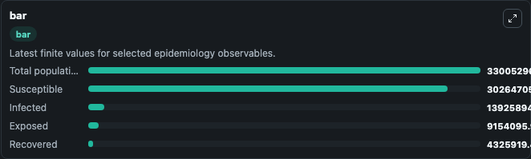
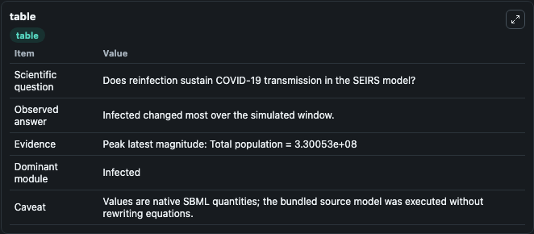

# Malkov2020 - SEIRS model of COVID-19 transmission with reinfection

This Biosimulant lab wraps `Malkov2020 - SEIRS model of COVID-19 transmission with reinfection` as a runnable epidemiology model with a companion visualization module.
Epidemiological models of COVID-19 transmission assume that recovered individuals have a fully protected immunity. To date, there is no definite answer about whether people who recover from COVID-19 c.

## What You'll See

The lab asks: Does reinfection sustain COVID-19 transmission in the SEIRS model? It runs for 10.0 time units with a communication step of 0.1. The run uses the model defaults declared by the curated SBML wrapper. The generated visualizations focus on Exposed, Infected, Susceptible, Recovered, and Total population, combining trajectory, endpoint-comparison, and summary-table views from one completed dark-mode run.

<!-- BIOSIMULANT_VISUALS_START -->
### Output Visualizations



*Time-series view for Malkov2020 - SEIRS model of COVID-19 transmission with reinfection, showing selected epidemiology state trajectories across the 10.0 simulation. The card is useful for reading peak timing, depletion, recovery, and persistence across Exposed, Infected, Susceptible, Recovered, and Total population.*



*Latest-value comparison for Malkov2020 - SEIRS model of COVID-19 transmission with reinfection, ranking the finite end-of-run values for the selected epidemiology observables. This makes the dominant compartments and residual states easier to compare at the simulation endpoint.*



*Summary table for Malkov2020 - SEIRS model of COVID-19 transmission with reinfection, collecting the run diagnostics reported by the visualization model, including duration simulated, observable coverage, largest change, and peak observable when available.*

<!-- BIOSIMULANT_VISUALS_END -->

## Model Context

- Core model: `models/core`
- Visualization model: `models/visualisation`
- Standard: `sbml`
- Upstream source: `biomodels_ebi:BIOMD0000000979`
- License: `CC0`

## Inputs

| Input | Maps To | Notes |
|---|---|---|
| Transmission Rate | `epidemiology_sbml_malkov2020_seirs_model_of_covid_19_transmission_biomd0000000979_model.transmission_rate` | Uses the model default unless overridden at run time. |
| Recovery Rate | `epidemiology_sbml_malkov2020_seirs_model_of_covid_19_transmission_biomd0000000979_model.recovery_rate` | Uses the model default unless overridden at run time. |
| Incubation Rate | `epidemiology_sbml_malkov2020_seirs_model_of_covid_19_transmission_biomd0000000979_model.incubation_rate` | Uses the model default unless overridden at run time. |

## Outputs

| Output | Maps To | Role |
|---|---|---|
| Model state | `state` | Available to the visualization model and downstream workflows. |
| Simulation summary | `summary` | Available to the visualization model and downstream workflows. |
| Species labels | `species_labels` | Available to the visualization model and downstream workflows. |
| Exposed | `Exposed` | Available to the visualization model and downstream workflows. |
| Infected | `Infected` | Available to the visualization model and downstream workflows. |
| Susceptible | `Susceptible` | Available to the visualization model and downstream workflows. |
| Recovered | `Recovered` | Available to the visualization model and downstream workflows. |
| Total population | `Total_population` | Available to the visualization model and downstream workflows. |

## Runtime

- Duration: `10.0`
- Communication step: `0.1`
- Capture run ID: `fa2eac18-ad0e-495b-a6a5-368cfd863db3`

## Running Locally

```bash
biosimulant labs serve .
```
