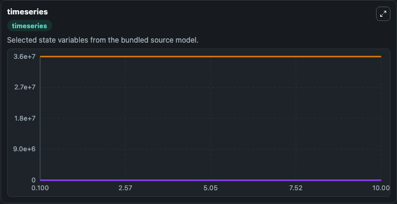
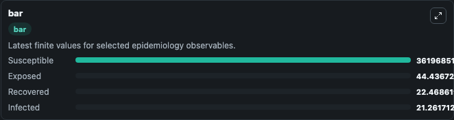
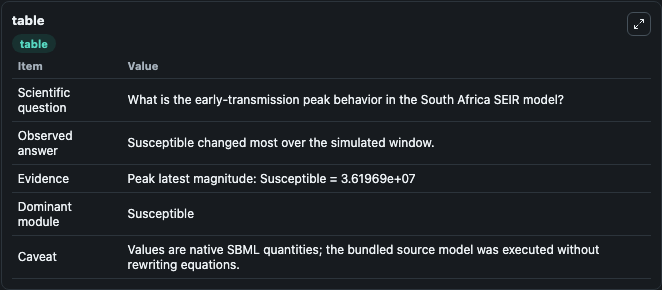

# Mukandavire2020 - SEIR model of early COVID-19 transmission in South Africa

This Biosimulant lab wraps `Mukandavire2020 - SEIR model of early COVID-19 transmission in South Africa` as a runnable epidemiology model with a companion visualization module.
The emergence and fast global spread of COVID-19 has presented one of the greatest public health challenges in modern times with no proven cure or vaccine. Africa is still early in this epidemic, ther.

## What You'll See

The lab asks: What is the early-transmission peak behavior in the South Africa SEIR model? It runs for 10.0 time units with a communication step of 0.1. The run uses the model defaults declared by the curated SBML wrapper. The generated visualizations focus on Exposed, Infected, Susceptible, and Recovered, combining trajectory, endpoint-comparison, and summary-table views from one completed dark-mode run.

<!-- BIOSIMULANT_VISUALS_START -->
### Output Visualizations



*Time-series view for Mukandavire2020 - SEIR model of early COVID-19 transmission in South Africa, showing selected epidemiology state trajectories across the 10.0 simulation. The card is useful for reading peak timing, depletion, recovery, and persistence across Exposed, Infected, Susceptible, and Recovered.*



*Latest-value comparison for Mukandavire2020 - SEIR model of early COVID-19 transmission in South Africa, ranking the finite end-of-run values for the selected epidemiology observables. This makes the dominant compartments and residual states easier to compare at the simulation endpoint.*



*Summary table for Mukandavire2020 - SEIR model of early COVID-19 transmission in South Africa, collecting the run diagnostics reported by the visualization model, including duration simulated, observable coverage, largest change, and peak observable when available.*

<!-- BIOSIMULANT_VISUALS_END -->

## Model Context

- Core model: `models/core`
- Visualization model: `models/visualisation`
- Standard: `sbml`
- Upstream source: `biomodels_ebi:BIOMD0000000978`
- License: `CC0`

## Inputs

| Input | Maps To | Notes |
|---|---|---|
| Transmission Rate | `epidemiology_sbml_mukandavire2020_seir_model_of_early_covid_19_tra_biomd0000000978_model.transmission_rate` | Uses the model default unless overridden at run time. |
| Exposed Progression Rate | `epidemiology_sbml_mukandavire2020_seir_model_of_early_covid_19_tra_biomd0000000978_model.exposed_progression_rate` | Uses the model default unless overridden at run time. |
| Recovery Rate | `epidemiology_sbml_mukandavire2020_seir_model_of_early_covid_19_tra_biomd0000000978_model.recovery_rate` | Uses the model default unless overridden at run time. |

## Outputs

| Output | Maps To | Role |
|---|---|---|
| Model state | `state` | Available to the visualization model and downstream workflows. |
| Simulation summary | `summary` | Available to the visualization model and downstream workflows. |
| Species labels | `species_labels` | Available to the visualization model and downstream workflows. |
| Exposed | `Exposed` | Available to the visualization model and downstream workflows. |
| Infected | `Infected` | Available to the visualization model and downstream workflows. |
| Susceptible | `Susceptible` | Available to the visualization model and downstream workflows. |
| Recovered | `Recovered` | Available to the visualization model and downstream workflows. |

## Runtime

- Duration: `10.0`
- Communication step: `0.1`
- Capture run ID: `b2d9c539-14c4-429d-aef3-4eeec5f0f101`

## Running Locally

```bash
biosimulant labs serve .
```
