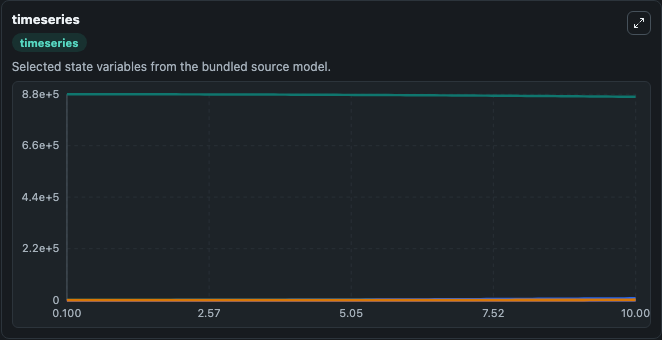
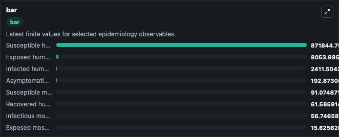
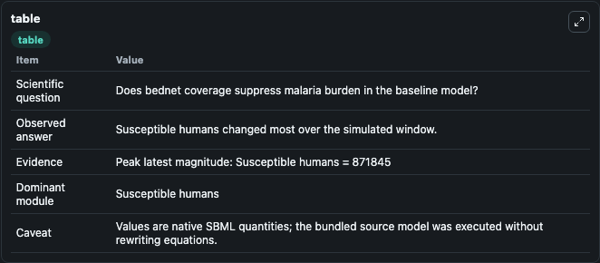

# Mukhta2018-the effect of bednet coverage on malaria transmission in South Sudan

This Biosimulant lab wraps `Mukhta2018-the effect of bednet coverage on malaria transmission in South Sudan` as a runnable epidemiology model with a companion visualization module.
A campaign for malaria control, using Long Lasting Insecticide Nets (LLINs) was launched in South Sudan in 2009. The success of such a campaign often depends upon adequate available resources and reli.

## What You'll See

The lab asks: Does bednet coverage suppress malaria burden in the baseline model? It runs for 10.0 time units with a communication step of 0.1. The run uses the model defaults declared by the curated SBML wrapper. The generated visualizations focus on Susceptible humans, Exposed humans, Infected humans, Asymptomatic humans, Recovered humans, and Susceptible mosquitoes, and related outputs, combining trajectory, endpoint-comparison, and summary-table views from one completed dark-mode run.

<!-- BIOSIMULANT_VISUALS_START -->
### Output Visualizations



*Time-series view for Mukhta2018-the effect of bednet coverage on malaria transmission in South Sudan, showing selected epidemiology state trajectories across the 10.0 simulation. The card is useful for reading peak timing, depletion, recovery, and persistence across Susceptible humans, Exposed humans, Infected humans, Asymptomatic humans, Recovered humans, and Susceptible mosquitoes, and related outputs.*



*Latest-value comparison for Mukhta2018-the effect of bednet coverage on malaria transmission in South Sudan, ranking the finite end-of-run values for the selected epidemiology observables. This makes the dominant compartments and residual states easier to compare at the simulation endpoint.*



*Summary table for Mukhta2018-the effect of bednet coverage on malaria transmission in South Sudan, collecting the run diagnostics reported by the visualization model, including duration simulated, observable coverage, largest change, and peak observable when available.*

<!-- BIOSIMULANT_VISUALS_END -->

## Model Context

- Core model: `models/core`
- Visualization model: `models/visualisation`
- Standard: `sbml`
- Upstream source: `biomodels_ebi:MODEL2003160003`
- License: `CC0`

## Inputs

| Input | Maps To | Notes |
|---|---|---|
| Bednet Coverage Factor | `epidemiology_sbml_mukhta2018_the_effect_of_bednet_coverage_on_mala_model2003160003_model.bednet_coverage_factor` | Uses the model default unless overridden at run time. |
| Mosquito Biting Rate | `epidemiology_sbml_mukhta2018_the_effect_of_bednet_coverage_on_mala_model2003160003_model.mosquito_biting_rate` | Uses the model default unless overridden at run time. |
| Mosquito Transmission Rate | `epidemiology_sbml_mukhta2018_the_effect_of_bednet_coverage_on_mala_model2003160003_model.mosquito_transmission_rate` | Uses the model default unless overridden at run time. |
| Human Recovery Rate | `epidemiology_sbml_mukhta2018_the_effect_of_bednet_coverage_on_mala_model2003160003_model.human_recovery_rate` | Uses the model default unless overridden at run time. |

## Outputs

| Output | Maps To | Role |
|---|---|---|
| Model state | `state` | Available to the visualization model and downstream workflows. |
| Simulation summary | `summary` | Available to the visualization model and downstream workflows. |
| Species labels | `species_labels` | Available to the visualization model and downstream workflows. |
| Susceptible humans | `S1` | Available to the visualization model and downstream workflows. |
| Exposed humans | `E1` | Available to the visualization model and downstream workflows. |
| Infected humans | `I1` | Available to the visualization model and downstream workflows. |
| Asymptomatic humans | `A1` | Available to the visualization model and downstream workflows. |
| Recovered humans | `R1` | Available to the visualization model and downstream workflows. |
| Susceptible mosquitoes | `X1` | Available to the visualization model and downstream workflows. |
| Exposed mosquitoes | `Y1` | Available to the visualization model and downstream workflows. |
| Infectious mosquitoes | `Z1` | Available to the visualization model and downstream workflows. |

## Runtime

- Duration: `10.0`
- Communication step: `0.1`
- Capture run ID: `b956546b-1cea-4448-be25-f8f4d1978e33`

## Running Locally

```bash
biosimulant labs serve .
```
