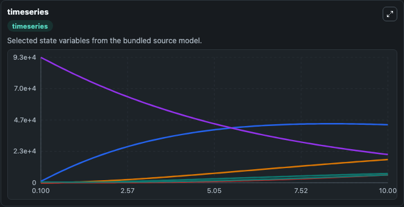
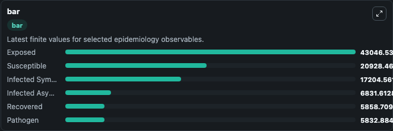
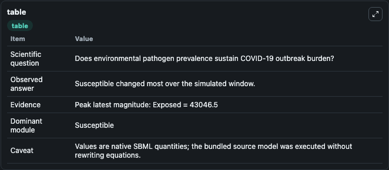

# Mwalili2020 - SEIR model of COVID-19 transmission and environmental pathogen prevalence

This Biosimulant lab wraps `Mwalili2020 - SEIR model of COVID-19 transmission and environmental pathogen prevalence` as a runnable epidemiology model with a companion visualization module.
Objective: Coronavirus disease 2019 (COVID-19) is a pandemic respiratory illness spreading from person-to-person caused by a novel coronavirus and poses a serious public health risk. It can be used to explore transmission dynamics and compare scenario outcomes across conditions.

## What You'll See

The lab asks: Does environmental pathogen prevalence sustain COVID-19 outbreak burden? It runs for 10.0 time units with a communication step of 0.1. The run uses the model defaults declared by the curated SBML wrapper. The generated visualizations focus on Infected Asymptomatic, Exposed, Infected Symptomatic, Susceptible, Recovered, and Pathogen, combining trajectory, endpoint-comparison, and summary-table views from one completed dark-mode run.

<!-- BIOSIMULANT_VISUALS_START -->
### Output Visualizations



*Time-series view for Mwalili2020 - SEIR model of COVID-19 transmission and environmental pathogen prevalence, showing selected epidemiology state trajectories across the 10.0 simulation. The card is useful for reading peak timing, depletion, recovery, and persistence across Infected Asymptomatic, Exposed, Infected Symptomatic, Susceptible, Recovered, and Pathogen.*



*Latest-value comparison for Mwalili2020 - SEIR model of COVID-19 transmission and environmental pathogen prevalence, ranking the finite end-of-run values for the selected epidemiology observables. This makes the dominant compartments and residual states easier to compare at the simulation endpoint.*



*Summary table for Mwalili2020 - SEIR model of COVID-19 transmission and environmental pathogen prevalence, collecting the run diagnostics reported by the visualization model, including duration simulated, observable coverage, largest change, and peak observable when available.*

<!-- BIOSIMULANT_VISUALS_END -->

## Model Context

- Core model: `models/core`
- Visualization model: `models/visualisation`
- Standard: `sbml`
- Upstream source: `biomodels_ebi:BIOMD0000000964`
- License: `CC0`

## Inputs

| Input | Maps To | Notes |
|---|---|---|
| Incubation Rate | `epidemiology_sbml_mwalili2020_seir_model_of_covid_19_transmission_biomd0000000964_model.incubation_rate` | Uses the model default unless overridden at run time. |

## Outputs

| Output | Maps To | Role |
|---|---|---|
| Model state | `state` | Available to the visualization model and downstream workflows. |
| Simulation summary | `summary` | Available to the visualization model and downstream workflows. |
| Species labels | `species_labels` | Available to the visualization model and downstream workflows. |
| Infected Asymptomatic | `Infected_Asymptomatic` | Available to the visualization model and downstream workflows. |
| Exposed | `Exposed` | Available to the visualization model and downstream workflows. |
| Infected Symptomatic | `Infected_Symptomatic` | Available to the visualization model and downstream workflows. |
| Susceptible | `Susceptible` | Available to the visualization model and downstream workflows. |
| Recovered | `Recovered` | Available to the visualization model and downstream workflows. |
| Pathogen | `Pathogen_0` | Available to the visualization model and downstream workflows. |

## Runtime

- Duration: `10.0`
- Communication step: `0.1`
- Capture run ID: `d23facbb-a460-4287-bc7f-b12be25f0406`

## Running Locally

```bash
biosimulant labs serve .
```
