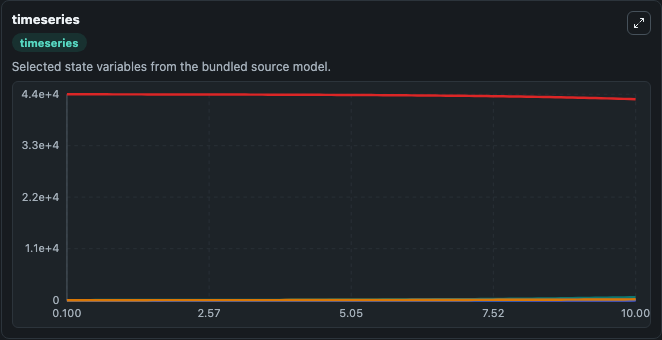
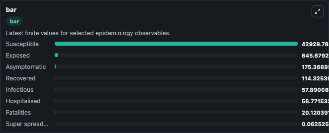
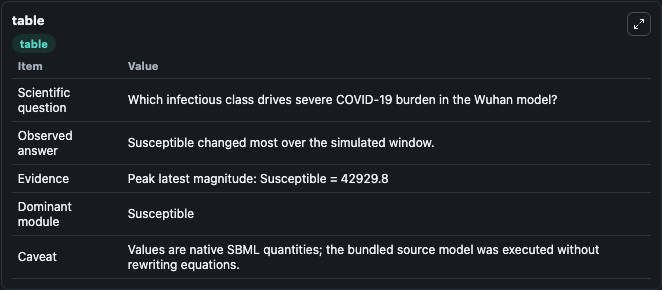

# Ndairou2020 - early-stage transmission dynamics of COVID-19 in Wuhan

This Biosimulant lab wraps `Ndairou2020 - early-stage transmission dynamics of COVID-19 in Wuhan` as a runnable epidemiology model with a companion visualization module.
We propose a compartmental mathematical model for the spread of the COVID-19 disease with special focus on the transmissibility of super-spreaders individuals. It can be used to explore transmission dynamics and compare scenario outcomes across conditions.

## What You'll See

The lab asks: Which infectious class drives severe COVID-19 burden in the Wuhan model? It runs for 10.0 time units with a communication step of 0.1. The run uses the model defaults declared by the curated SBML wrapper. The generated visualizations focus on Exposed, Infectious, Hospitalised, Fatalities, Susceptible, and Recovered, and related outputs, combining trajectory, endpoint-comparison, and summary-table views from one completed dark-mode run.

<!-- BIOSIMULANT_VISUALS_START -->
### Output Visualizations



*Time-series view for Ndairou2020 - early-stage transmission dynamics of COVID-19 in Wuhan, showing selected epidemiology state trajectories across the 10.0 simulation. The card is useful for reading peak timing, depletion, recovery, and persistence across Exposed, Infectious, Hospitalised, Fatalities, Susceptible, and Recovered, and related outputs.*



*Latest-value comparison for Ndairou2020 - early-stage transmission dynamics of COVID-19 in Wuhan, ranking the finite end-of-run values for the selected epidemiology observables. This makes the dominant compartments and residual states easier to compare at the simulation endpoint.*



*Summary table for Ndairou2020 - early-stage transmission dynamics of COVID-19 in Wuhan, collecting the run diagnostics reported by the visualization model, including duration simulated, observable coverage, largest change, and peak observable when available.*

<!-- BIOSIMULANT_VISUALS_END -->

## Model Context

- Core model: `models/core`
- Visualization model: `models/visualisation`
- Standard: `sbml`
- Upstream source: `biomodels_ebi:BIOMD0000000958`
- License: `CC0`

## Inputs

| Input | Maps To | Notes |
|---|---|---|
| Transmission Rate | `epidemiology_sbml_ndairou2020_early_stage_transmission_dynamics_of_biomd0000000958_model.transmission_rate` | Uses the model default unless overridden at run time. |

## Outputs

| Output | Maps To | Role |
|---|---|---|
| Model state | `state` | Available to the visualization model and downstream workflows. |
| Simulation summary | `summary` | Available to the visualization model and downstream workflows. |
| Species labels | `species_labels` | Available to the visualization model and downstream workflows. |
| Exposed | `Exposed` | Available to the visualization model and downstream workflows. |
| Infectious | `Infectious` | Available to the visualization model and downstream workflows. |
| Hospitalised | `Hospitalised` | Available to the visualization model and downstream workflows. |
| Fatalities | `Fatalities` | Available to the visualization model and downstream workflows. |
| Susceptible | `Susceptible` | Available to the visualization model and downstream workflows. |
| Recovered | `Recovered` | Available to the visualization model and downstream workflows. |
| Super spreaders | `Super_spreaders` | Available to the visualization model and downstream workflows. |
| Asymptomatic | `Asymptomatic` | Available to the visualization model and downstream workflows. |

## Runtime

- Duration: `10.0`
- Communication step: `0.1`
- Capture run ID: `c19b382a-a947-43e8-8f4a-13ce0e41b33c`

## Running Locally

```bash
biosimulant labs serve .
```
