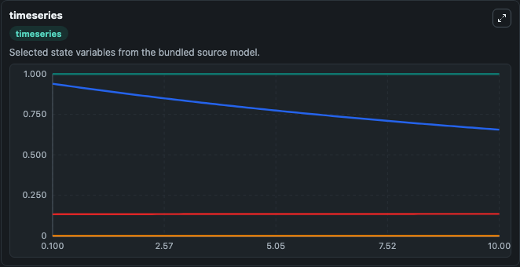
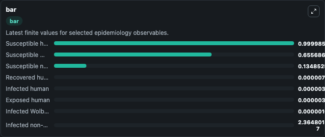
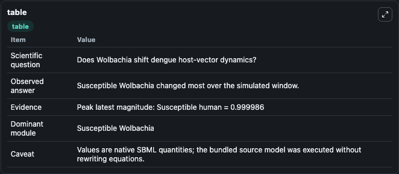

# Ndii2015-transmission dynamics of dengue in the presence of Wolbachia

This Biosimulant lab wraps `Ndii2015-transmission dynamics of dengue in the presence of Wolbachia` as a runnable epidemiology model with a companion visualization module.
Use of the bacterium Wolbachia is an innovative new strategy designed to break the cycle of dengue transmission. There are two main mechanisms by which Wolbachia could achieve this: by reducing the le.

## What You'll See

The lab asks: Does Wolbachia shift dengue host-vector dynamics? It runs for 10.0 time units with a communication step of 0.1. The run uses the model defaults declared by the curated SBML wrapper. The generated visualizations focus on Susceptible human, Exposed human, Infected human, Recovered human, Susceptible non-Wolbachia, and Infected non-Wolbachia, and related outputs, combining trajectory, endpoint-comparison, and summary-table views from one completed dark-mode run.

<!-- BIOSIMULANT_VISUALS_START -->
### Output Visualizations



*Time-series view for Ndii2015-transmission dynamics of dengue in the presence of Wolbachia, showing selected epidemiology state trajectories across the 10.0 simulation. The card is useful for reading peak timing, depletion, recovery, and persistence across Susceptible human, Exposed human, Infected human, Recovered human, Susceptible non-Wolbachia, and Infected non-Wolbachia, and related outputs.*



*Latest-value comparison for Ndii2015-transmission dynamics of dengue in the presence of Wolbachia, ranking the finite end-of-run values for the selected epidemiology observables. This makes the dominant compartments and residual states easier to compare at the simulation endpoint.*



*Summary table for Ndii2015-transmission dynamics of dengue in the presence of Wolbachia, collecting the run diagnostics reported by the visualization model, including duration simulated, observable coverage, largest change, and peak observable when available.*

<!-- BIOSIMULANT_VISUALS_END -->

## Model Context

- Core model: `models/core`
- Visualization model: `models/visualisation`
- Standard: `sbml`
- Upstream source: `biomodels_ebi:MODEL2003160002`
- License: `CC0`

## Inputs

| Input | Maps To | Notes |
|---|---|---|
| Human Incubation Rate | `epidemiology_sbml_ndii2015_transmission_dynamics_of_dengue_in_the_model2003160002_model.human_incubation_rate` | Uses the model default unless overridden at run time. |
| Wolbachia Transmission Reduction | `epidemiology_sbml_ndii2015_transmission_dynamics_of_dengue_in_the_model2003160002_model.wolbachia_transmission_reduction` | Uses the model default unless overridden at run time. |
| Human Recovery Rate | `epidemiology_sbml_ndii2015_transmission_dynamics_of_dengue_in_the_model2003160002_model.human_recovery_rate` | Uses the model default unless overridden at run time. |
| Non Wolbachia Mosquito Birth Rate | `epidemiology_sbml_ndii2015_transmission_dynamics_of_dengue_in_the_model2003160002_model.non_wolbachia_mosquito_birth_rate` | Uses the model default unless overridden at run time. |
| Wolbachia Mosquito Birth Rate | `epidemiology_sbml_ndii2015_transmission_dynamics_of_dengue_in_the_model2003160002_model.wolbachia_mosquito_birth_rate` | Uses the model default unless overridden at run time. |

## Outputs

| Output | Maps To | Role |
|---|---|---|
| Model state | `state` | Available to the visualization model and downstream workflows. |
| Simulation summary | `summary` | Available to the visualization model and downstream workflows. |
| Species labels | `species_labels` | Available to the visualization model and downstream workflows. |
| Susceptible human | `S_H` | Available to the visualization model and downstream workflows. |
| Exposed human | `E_H` | Available to the visualization model and downstream workflows. |
| Infected human | `I_H` | Available to the visualization model and downstream workflows. |
| Recovered human | `R_H` | Available to the visualization model and downstream workflows. |
| Susceptible non-Wolbachia | `S_N` | Available to the visualization model and downstream workflows. |
| Infected non-Wolbachia | `I_N` | Available to the visualization model and downstream workflows. |
| Susceptible Wolbachia | `S_W` | Available to the visualization model and downstream workflows. |
| Infected Wolbachia | `I_W` | Available to the visualization model and downstream workflows. |

## Runtime

- Duration: `10.0`
- Communication step: `0.1`
- Capture run ID: `23753462-a882-4f36-b9bc-5dc6363d4b55`

## Running Locally

```bash
biosimulant labs serve .
```
