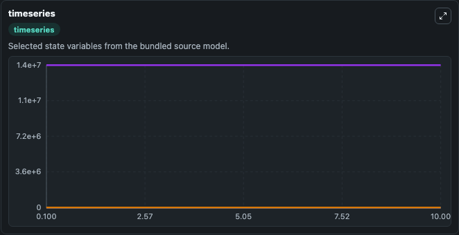
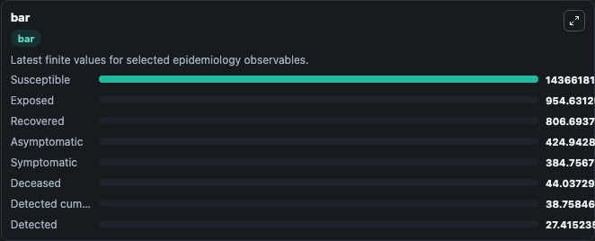
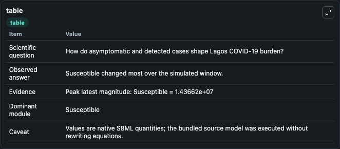

# Okuonghae2020 - SEAIR model of COVID-19 transmission in Lagos, Nigeria

This Biosimulant lab wraps `Okuonghae2020 - SEAIR model of COVID-19 transmission in Lagos, Nigeria` as a runnable epidemiology model with a companion visualization module.
This work examines the impact of various non-pharmaceutical control measures (government and personal) on the population dynamics of the novel coronavirus disease 2019 (COVID-19) in Lagos, Nigeria, us. It can be used to explore transmission dynamics and compare scenario outcomes across conditions.

## What You'll See

The lab asks: How do asymptomatic and detected cases shape Lagos COVID-19 burden? It runs for 10.0 time units with a communication step of 0.1. The run uses the model defaults declared by the curated SBML wrapper. The generated visualizations focus on Asymptomatic, Exposed, Deceased, Susceptible, Recovered, and Symptomatic, and related outputs, combining trajectory, endpoint-comparison, and summary-table views from one completed dark-mode run.

<!-- BIOSIMULANT_VISUALS_START -->
### Output Visualizations



*Time-series view for Okuonghae2020 - SEAIR model of COVID-19 transmission in Lagos, Nigeria, showing selected epidemiology state trajectories across the 10.0 simulation. The card is useful for reading peak timing, depletion, recovery, and persistence across Asymptomatic, Exposed, Deceased, Susceptible, Recovered, and Symptomatic, and related outputs.*



*Latest-value comparison for Okuonghae2020 - SEAIR model of COVID-19 transmission in Lagos, Nigeria, ranking the finite end-of-run values for the selected epidemiology observables. This makes the dominant compartments and residual states easier to compare at the simulation endpoint.*



*Summary table for Okuonghae2020 - SEAIR model of COVID-19 transmission in Lagos, Nigeria, collecting the run diagnostics reported by the visualization model, including duration simulated, observable coverage, largest change, and peak observable when available.*

<!-- BIOSIMULANT_VISUALS_END -->

## Model Context

- Core model: `models/core`
- Visualization model: `models/visualisation`
- Standard: `sbml`
- Upstream source: `biomodels_ebi:BIOMD0000000991`
- License: `CC0`

## Inputs

| Input | Maps To | Notes |
|---|---|---|
| Incubation Rate | `epidemiology_sbml_okuonghae2020_seair_model_of_covid_19_transmissi_biomd0000000991_model.incubation_rate` | Uses the model default unless overridden at run time. |

## Outputs

| Output | Maps To | Role |
|---|---|---|
| Model state | `state` | Available to the visualization model and downstream workflows. |
| Simulation summary | `summary` | Available to the visualization model and downstream workflows. |
| Species labels | `species_labels` | Available to the visualization model and downstream workflows. |
| Asymptomatic | `asymptomatic` | Available to the visualization model and downstream workflows. |
| Exposed | `exposed` | Available to the visualization model and downstream workflows. |
| Deceased | `deceased` | Available to the visualization model and downstream workflows. |
| Susceptible | `susceptible` | Available to the visualization model and downstream workflows. |
| Recovered | `recovered` | Available to the visualization model and downstream workflows. |
| Symptomatic | `symptomatic` | Available to the visualization model and downstream workflows. |
| Detected | `detected` | Available to the visualization model and downstream workflows. |
| Detected cumulative | `detected_cumulative` | Available to the visualization model and downstream workflows. |

## Runtime

- Duration: `10.0`
- Communication step: `0.1`
- Capture run ID: `834e27b7-5a9b-4c83-b5e9-326fe5686b75`

## Running Locally

```bash
biosimulant labs serve .
```
