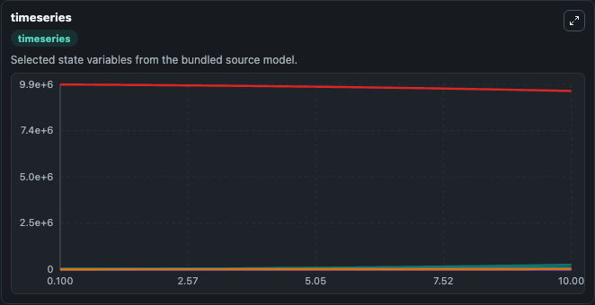
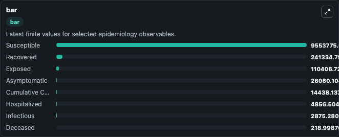
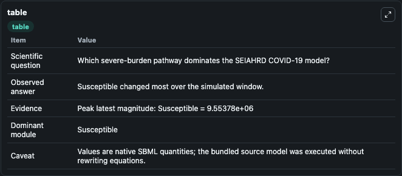

# Paiva2020 - SEIAHRD model of transmission dynamics of COVID-19

This Biosimulant lab wraps `Paiva2020 - SEIAHRD model of transmission dynamics of COVID-19` as a runnable epidemiology model with a companion visualization module.
This paper proposes a dynamic model to describe and forecast the dynamics of the coronavirus disease COVID-19 transmission. The model is based on an approach previously used to describe the Middle Eas.

## What You'll See

The lab asks: Which severe-burden pathway dominates the SEIAHRD COVID-19 model? It runs for 10.0 time units with a communication step of 0.1. The run uses the model defaults declared by the curated SBML wrapper. The generated visualizations focus on Exposed, Infectious, Hospitalized, Deceased, Susceptible, and Recovered, and related outputs, combining trajectory, endpoint-comparison, and summary-table views from one completed dark-mode run.

<!-- BIOSIMULANT_VISUALS_START -->
### Output Visualizations



*Time-series view for Paiva2020 - SEIAHRD model of transmission dynamics of COVID-19, showing selected epidemiology state trajectories across the 10.0 simulation. The card is useful for reading peak timing, depletion, recovery, and persistence across Exposed, Infectious, Hospitalized, Deceased, Susceptible, and Recovered, and related outputs.*



*Latest-value comparison for Paiva2020 - SEIAHRD model of transmission dynamics of COVID-19, ranking the finite end-of-run values for the selected epidemiology observables. This makes the dominant compartments and residual states easier to compare at the simulation endpoint.*



*Summary table for Paiva2020 - SEIAHRD model of transmission dynamics of COVID-19, collecting the run diagnostics reported by the visualization model, including duration simulated, observable coverage, largest change, and peak observable when available.*

<!-- BIOSIMULANT_VISUALS_END -->

## Model Context

- Core model: `models/core`
- Visualization model: `models/visualisation`
- Standard: `sbml`
- Upstream source: `biomodels_ebi:BIOMD0000000960`
- License: `CC0`

## Inputs

| Input | Maps To | Notes |
|---|---|---|
| Transmission Rate | `epidemiology_sbml_paiva2020_seiahrd_model_of_transmission_dynamics_biomd0000000960_model.transmission_rate` | Uses the model default unless overridden at run time. |
| Incubation Rate | `epidemiology_sbml_paiva2020_seiahrd_model_of_transmission_dynamics_biomd0000000960_model.incubation_rate` | Uses the model default unless overridden at run time. |
| Asymptomatic Fraction | `epidemiology_sbml_paiva2020_seiahrd_model_of_transmission_dynamics_biomd0000000960_model.asymptomatic_fraction` | Uses the model default unless overridden at run time. |
| Hospitalization Rate | `epidemiology_sbml_paiva2020_seiahrd_model_of_transmission_dynamics_biomd0000000960_model.hospitalization_rate` | Uses the model default unless overridden at run time. |
| Hospital Mortality Rate | `epidemiology_sbml_paiva2020_seiahrd_model_of_transmission_dynamics_biomd0000000960_model.hospital_mortality_rate` | Uses the model default unless overridden at run time. |
| Infectious Mortality Rate | `epidemiology_sbml_paiva2020_seiahrd_model_of_transmission_dynamics_biomd0000000960_model.infectious_mortality_rate` | Uses the model default unless overridden at run time. |

## Outputs

| Output | Maps To | Role |
|---|---|---|
| Model state | `state` | Available to the visualization model and downstream workflows. |
| Simulation summary | `summary` | Available to the visualization model and downstream workflows. |
| Species labels | `species_labels` | Available to the visualization model and downstream workflows. |
| Exposed | `Exposed` | Available to the visualization model and downstream workflows. |
| Infectious | `Infectious` | Available to the visualization model and downstream workflows. |
| Hospitalized | `Hospitalized` | Available to the visualization model and downstream workflows. |
| Deceased | `Deceased` | Available to the visualization model and downstream workflows. |
| Susceptible | `Susceptible` | Available to the visualization model and downstream workflows. |
| Recovered | `Recovered` | Available to the visualization model and downstream workflows. |
| Asymptomatic | `Asymptomatic` | Available to the visualization model and downstream workflows. |
| Cumulative Cases | `Cumulative_Cases` | Available to the visualization model and downstream workflows. |

## Runtime

- Duration: `10.0`
- Communication step: `0.1`
- Capture run ID: `fd9fefb0-9dc9-4984-a439-f0a32ee21f52`

## Running Locally

```bash
biosimulant labs serve .
```
