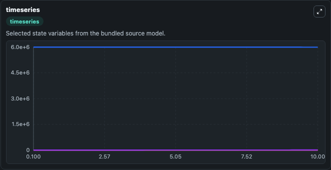
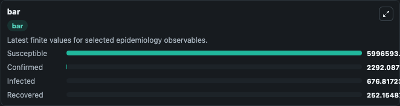
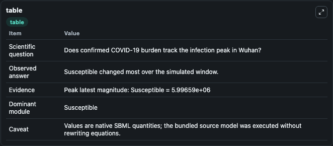

# Roda2020 - SIR model of COVID-19 spread in Wuhan

This Biosimulant lab wraps `Roda2020 - SIR model of COVID-19 spread in Wuhan` as a runnable epidemiology model with a companion visualization module.
=Since the COVID-19 outbreak in Wuhan City in December of 2019, numerous model predictions on the COVID-19 epidemics in Wuhan and other parts of China have been reported. It can be used to explore transmission dynamics and compare scenario outcomes across conditions.

## What You'll See

The lab asks: Does confirmed COVID-19 burden track the infection peak in Wuhan? It runs for 10.0 time units with a communication step of 0.1. The run uses the model defaults declared by the curated SBML wrapper. The generated visualizations focus on Infected, Susceptible, Recovered, and Confirmed, combining trajectory, endpoint-comparison, and summary-table views from one completed dark-mode run.

<!-- BIOSIMULANT_VISUALS_START -->
### Output Visualizations



*Time-series view for Roda2020 - SIR model of COVID-19 spread in Wuhan, showing selected epidemiology state trajectories across the 10.0 simulation. The card is useful for reading peak timing, depletion, recovery, and persistence across Infected, Susceptible, Recovered, and Confirmed.*



*Latest-value comparison for Roda2020 - SIR model of COVID-19 spread in Wuhan, ranking the finite end-of-run values for the selected epidemiology observables. This makes the dominant compartments and residual states easier to compare at the simulation endpoint.*



*Summary table for Roda2020 - SIR model of COVID-19 spread in Wuhan, collecting the run diagnostics reported by the visualization model, including duration simulated, observable coverage, largest change, and peak observable when available.*

<!-- BIOSIMULANT_VISUALS_END -->

## Model Context

- Core model: `models/core`
- Visualization model: `models/visualisation`
- Standard: `sbml`
- Upstream source: `biomodels_ebi:BIOMD0000000957`
- License: `CC0`

## Inputs

| Input | Maps To | Notes |
|---|---|---|
| Transmission Rate | `epidemiology_sbml_roda2020_sir_model_of_covid_19_spread_in_wuhan_biomd0000000957_model.transmission_rate` | Uses the model default unless overridden at run time. |

## Outputs

| Output | Maps To | Role |
|---|---|---|
| Model state | `state` | Available to the visualization model and downstream workflows. |
| Simulation summary | `summary` | Available to the visualization model and downstream workflows. |
| Species labels | `species_labels` | Available to the visualization model and downstream workflows. |
| Infected | `Infected` | Available to the visualization model and downstream workflows. |
| Susceptible | `Susceptible` | Available to the visualization model and downstream workflows. |
| Recovered | `Recovered` | Available to the visualization model and downstream workflows. |
| Confirmed | `Confirmed` | Available to the visualization model and downstream workflows. |

## Runtime

- Duration: `10.0`
- Communication step: `0.1`
- Capture run ID: `85a1e5dc-7331-478e-8c22-5ad19cfcca94`

## Running Locally

```bash
biosimulant labs serve .
```
