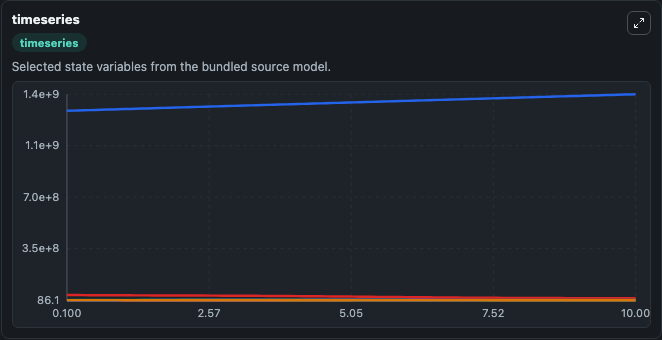
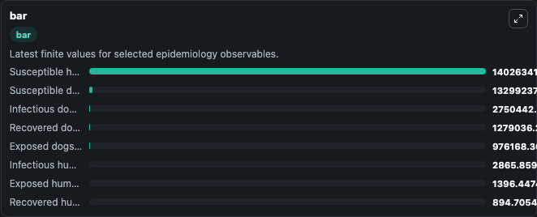
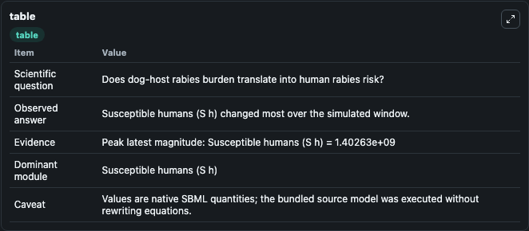

# Ruan2017 - Transmission dynamics and control of rabies in China

This Biosimulant lab wraps `Ruan2017 - Transmission dynamics and control of rabies in China` as a runnable epidemiology model with a companion visualization module.
Shigui Ruan. Modeling the transmission dynamics and control of rabies in China.

## What You'll See

The lab asks: Does dog-host rabies burden translate into human rabies risk? It runs for 10.0 time units with a communication step of 0.1. The run uses the model defaults declared by the curated SBML wrapper. The generated visualizations focus on Exposed humans (E h), Infectious humans (I h), Exposed dogs (E d), Infectious dogs (I d), Susceptible dogs (S d), and Recovered dogs (R d), and related outputs, combining trajectory, endpoint-comparison, and summary-table views from one completed dark-mode run.

<!-- BIOSIMULANT_VISUALS_START -->
### Output Visualizations



*Time-series view for Ruan2017 - Transmission dynamics and control of rabies in China, showing selected epidemiology state trajectories across the 10.0 simulation. The card is useful for reading peak timing, depletion, recovery, and persistence across Exposed humans (E h), Infectious humans (I h), Exposed dogs (E d), Infectious dogs (I d), Susceptible dogs (S d), and Recovered dogs (R d), and related outputs.*



*Latest-value comparison for Ruan2017 - Transmission dynamics and control of rabies in China, ranking the finite end-of-run values for the selected epidemiology observables. This makes the dominant compartments and residual states easier to compare at the simulation endpoint.*



*Summary table for Ruan2017 - Transmission dynamics and control of rabies in China, collecting the run diagnostics reported by the visualization model, including duration simulated, observable coverage, largest change, and peak observable when available.*

<!-- BIOSIMULANT_VISUALS_END -->

## Model Context

- Core model: `models/core`
- Visualization model: `models/visualisation`
- Standard: `sbml`
- Upstream source: `biomodels_ebi:BIOMD0000000726`
- License: `CC0`

## Inputs

| Input | Maps To | Notes |
|---|---|---|
| Transmission Rate | `epidemiology_sbml_ruan2017_transmission_dynamics_and_control_of_ra_biomd0000000726_model.transmission_rate` | Uses the model default unless overridden at run time. |
| Recovery Rate | `epidemiology_sbml_ruan2017_transmission_dynamics_and_control_of_ra_biomd0000000726_model.recovery_rate` | Uses the model default unless overridden at run time. |
| Incubation Rate | `epidemiology_sbml_ruan2017_transmission_dynamics_and_control_of_ra_biomd0000000726_model.incubation_rate` | Uses the model default unless overridden at run time. |

## Outputs

| Output | Maps To | Role |
|---|---|---|
| Model state | `state` | Available to the visualization model and downstream workflows. |
| Simulation summary | `summary` | Available to the visualization model and downstream workflows. |
| Species labels | `species_labels` | Available to the visualization model and downstream workflows. |
| Exposed humans (E h) | `E_h` | Available to the visualization model and downstream workflows. |
| Infectious humans (I h) | `I_h` | Available to the visualization model and downstream workflows. |
| Exposed dogs (E d) | `E_d` | Available to the visualization model and downstream workflows. |
| Infectious dogs (I d) | `I_d` | Available to the visualization model and downstream workflows. |
| Susceptible dogs (S d) | `S_d` | Available to the visualization model and downstream workflows. |
| Recovered dogs (R d) | `R_d` | Available to the visualization model and downstream workflows. |
| Susceptible humans (S h) | `S_h` | Available to the visualization model and downstream workflows. |
| Recovered humans (R h) | `R_h` | Available to the visualization model and downstream workflows. |

## Runtime

- Duration: `10.0`
- Communication step: `0.1`
- Capture run ID: `f0437405-7bf6-4ec2-beb2-b956508d490d`

## Running Locally

```bash
biosimulant labs serve .
```
