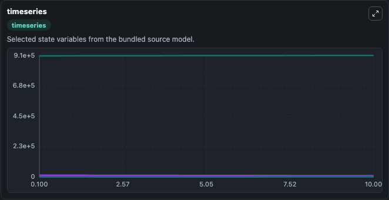
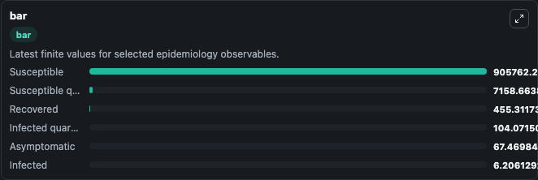
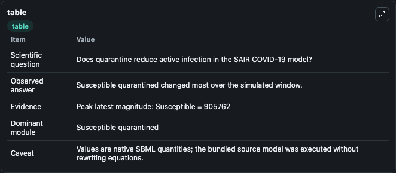

# Sarkar2020 - SAIR model of COVID-19 transmission with quarantine measures in India

This Biosimulant lab wraps `Sarkar2020 - SAIR model of COVID-19 transmission with quarantine measures in India` as a runnable epidemiology model with a companion visualization module.
In India, 100,340 confirmed cases and 3155 confirmed deaths due to COVID-19 were reported as of May 18, 2020. Due to absence of specific vaccine or therapy, non-pharmacological interventions including.

## What You'll See

The lab asks: Does quarantine reduce active infection in the SAIR COVID-19 model? It runs for 10.0 time units with a communication step of 0.1. The run uses the model defaults declared by the curated SBML wrapper. The generated visualizations focus on Susceptible, Infected, Asymptomatic, Susceptible quarantined, Infected quarantined, and Recovered, combining trajectory, endpoint-comparison, and summary-table views from one completed dark-mode run.

<!-- BIOSIMULANT_VISUALS_START -->
### Output Visualizations



*Time-series view for Sarkar2020 - SAIR model of COVID-19 transmission with quarantine measures in India, showing selected epidemiology state trajectories across the 10.0 simulation. The card is useful for reading peak timing, depletion, recovery, and persistence across Susceptible, Infected, Asymptomatic, Susceptible quarantined, Infected quarantined, and Recovered.*



*Latest-value comparison for Sarkar2020 - SAIR model of COVID-19 transmission with quarantine measures in India, ranking the finite end-of-run values for the selected epidemiology observables. This makes the dominant compartments and residual states easier to compare at the simulation endpoint.*



*Summary table for Sarkar2020 - SAIR model of COVID-19 transmission with quarantine measures in India, collecting the run diagnostics reported by the visualization model, including duration simulated, observable coverage, largest change, and peak observable when available.*

<!-- BIOSIMULANT_VISUALS_END -->

## Model Context

- Core model: `models/core`
- Visualization model: `models/visualisation`
- Standard: `sbml`
- Upstream source: `biomodels_ebi:BIOMD0000000977`
- License: `CC0`

## Inputs

| Input | Maps To | Notes |
|---|---|---|
| Transmission Rate | `epidemiology_sbml_sarkar2020_sair_model_of_covid_19_transmission_w_biomd0000000977_model.transmission_rate` | Uses the model default unless overridden at run time. |
| Asymptomatic Fraction | `epidemiology_sbml_sarkar2020_sair_model_of_covid_19_transmission_w_biomd0000000977_model.asymptomatic_fraction` | Uses the model default unless overridden at run time. |
| Quarantine Transition Rate | `epidemiology_sbml_sarkar2020_sair_model_of_covid_19_transmission_w_biomd0000000977_model.quarantine_transition_rate` | Uses the model default unless overridden at run time. |
| Infected Recovery Rate | `epidemiology_sbml_sarkar2020_sair_model_of_covid_19_transmission_w_biomd0000000977_model.infected_recovery_rate` | Uses the model default unless overridden at run time. |
| Asymptomatic Recovery Rate | `epidemiology_sbml_sarkar2020_sair_model_of_covid_19_transmission_w_biomd0000000977_model.asymptomatic_recovery_rate` | Uses the model default unless overridden at run time. |

## Outputs

| Output | Maps To | Role |
|---|---|---|
| Model state | `state` | Available to the visualization model and downstream workflows. |
| Simulation summary | `summary` | Available to the visualization model and downstream workflows. |
| Species labels | `species_labels` | Available to the visualization model and downstream workflows. |
| Susceptible | `Susceptible` | Available to the visualization model and downstream workflows. |
| Infected | `Infected` | Available to the visualization model and downstream workflows. |
| Asymptomatic | `Asymptomatic` | Available to the visualization model and downstream workflows. |
| Susceptible quarantined | `Susceptible_quarantined` | Available to the visualization model and downstream workflows. |
| Infected quarantined | `Exposed_quarantined` | Available to the visualization model and downstream workflows. |
| Recovered | `Recovered` | Available to the visualization model and downstream workflows. |

## Runtime

- Duration: `10.0`
- Communication step: `0.1`
- Capture run ID: `263443ac-20be-4bdc-984b-d4915bde2c3e`

## Running Locally

```bash
biosimulant labs serve .
```
