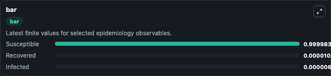
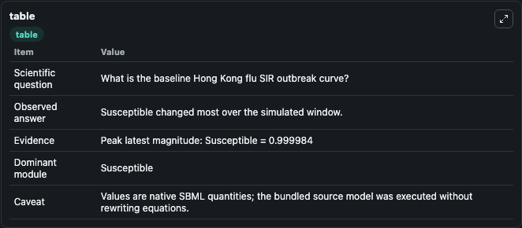

# Smith&Moore2004 - The SIR model for the spread of HongKong Flu

This Biosimulant lab wraps `Smith&Moore2004 - The SIR model for the spread of HongKong Flu` as a runnable epidemiology model with a companion visualization module.
This is the SIR model for disease spread of the Hong Kong flu in New York City in the late 1960's. It can be used to explore transmission dynamics and compare scenario outcomes across conditions.

## What You'll See

The lab asks: What is the baseline Hong Kong flu SIR outbreak curve? It runs for 10.0 time units with a communication step of 0.1. The run uses the model defaults declared by the curated SBML wrapper. The generated visualizations focus on Infected, Susceptible, and Recovered, combining trajectory, endpoint-comparison, and summary-table views from one completed dark-mode run.

<!-- BIOSIMULANT_VISUALS_START -->
### Output Visualizations


*Time-series view for Smith&Moore2004 - The SIR model for the spread of HongKong Flu, showing selected epidemiology state trajectories across the 10.0 simulation. The card is useful for reading peak timing, depletion, recovery, and persistence across Infected, Susceptible, and Recovered.*



*Latest-value comparison for Smith&Moore2004 - The SIR model for the spread of HongKong Flu, ranking the finite end-of-run values for the selected epidemiology observables. This makes the dominant compartments and residual states easier to compare at the simulation endpoint.*



*Summary table for Smith&Moore2004 - The SIR model for the spread of HongKong Flu, collecting the run diagnostics reported by the visualization model, including duration simulated, observable coverage, largest change, and peak observable when available.*

<!-- BIOSIMULANT_VISUALS_END -->

## Model Context

- Core model: `models/core`
- Visualization model: `models/visualisation`
- Standard: `sbml`
- Upstream source: `biomodels_ebi:BIOMD0000001045`
- License: `CC0`

## Inputs

| Input | Maps To | Notes |
|---|---|---|
| Transmission Rate | `epidemiology_sbml_smithandmoore2004_the_sir_model_for_the_spread_o_biomd0000001045_model.transmission_rate` | Uses the model default unless overridden at run time. |

## Outputs

| Output | Maps To | Role |
|---|---|---|
| Model state | `state` | Available to the visualization model and downstream workflows. |
| Simulation summary | `summary` | Available to the visualization model and downstream workflows. |
| Species labels | `species_labels` | Available to the visualization model and downstream workflows. |
| Infected | `Infected` | Available to the visualization model and downstream workflows. |
| Susceptible | `Susceptible` | Available to the visualization model and downstream workflows. |
| Recovered | `Recovered` | Available to the visualization model and downstream workflows. |

## Runtime

- Duration: `10.0`
- Communication step: `0.1`
- Capture run ID: `457a9f7d-68ac-4eb6-bffe-77396ade248c`

## Running Locally

```bash
biosimulant labs serve .
```
