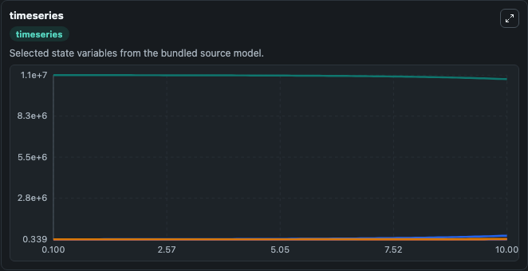
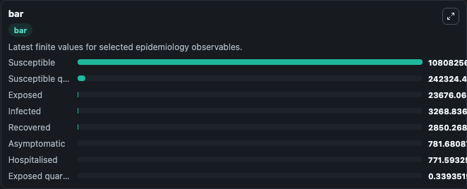
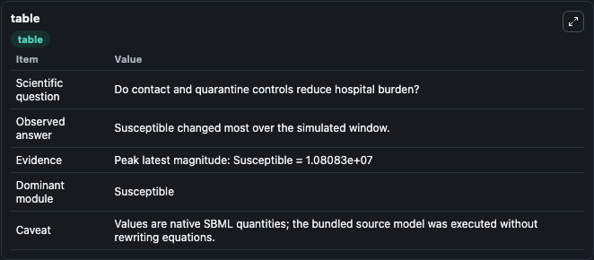

# Tang2020 - Estimation of transmission risk of COVID-19 and impact of public health interventions

This Biosimulant lab wraps `Tang2020 - Estimation of transmission risk of COVID-19 and impact of public health interventions` as a runnable epidemiology model with a companion visualization module.
Since the emergence of the first cases in Wuhan, China, the novel coronavirus (2019-nCoV) infection has been quickly spreading out to other provinces and neighboring countries. It can be used to explore transmission dynamics and compare scenario outcomes across conditions.

## What You'll See

The lab asks: Do contact and quarantine controls reduce hospital burden? It runs for 10.0 time units with a communication step of 0.1. The run uses the model defaults declared by the curated SBML wrapper. The generated visualizations focus on Exposed quarantined, Susceptible quarantined, Exposed, Infected, Hospitalised, and Susceptible, and related outputs, combining trajectory, endpoint-comparison, and summary-table views from one completed dark-mode run.

<!-- BIOSIMULANT_VISUALS_START -->
### Output Visualizations



*Time-series view for Tang2020 - Estimation of transmission risk of COVID-19 and impact of public health interventions, showing selected epidemiology state trajectories across the 10.0 simulation. The card is useful for reading peak timing, depletion, recovery, and persistence across Exposed quarantined, Susceptible quarantined, Exposed, Infected, Hospitalised, and Susceptible, and related outputs.*



*Latest-value comparison for Tang2020 - Estimation of transmission risk of COVID-19 and impact of public health interventions, ranking the finite end-of-run values for the selected epidemiology observables. This makes the dominant compartments and residual states easier to compare at the simulation endpoint.*



*Summary table for Tang2020 - Estimation of transmission risk of COVID-19 and impact of public health interventions, collecting the run diagnostics reported by the visualization model, including duration simulated, observable coverage, largest change, and peak observable when available.*

<!-- BIOSIMULANT_VISUALS_END -->

## Model Context

- Core model: `models/core`
- Visualization model: `models/visualisation`
- Standard: `sbml`
- Upstream source: `biomodels_ebi:BIOMD0000000971`
- License: `CC0`

## Inputs

| Input | Maps To | Notes |
|---|---|---|
| Transmission Probability | `epidemiology_sbml_tang2020_estimation_of_transmission_risk_of_covi_biomd0000000971_model.transmission_probability` | Uses the model default unless overridden at run time. |
| Exposed Progression Rate | `epidemiology_sbml_tang2020_estimation_of_transmission_risk_of_covi_biomd0000000971_model.exposed_progression_rate` | Uses the model default unless overridden at run time. |
| Daily Contact Rate | `epidemiology_sbml_tang2020_estimation_of_transmission_risk_of_covi_biomd0000000971_model.daily_contact_rate` | Uses the model default unless overridden at run time. |
| Quarantine Probability | `epidemiology_sbml_tang2020_estimation_of_transmission_risk_of_covi_biomd0000000971_model.quarantine_probability` | Uses the model default unless overridden at run time. |
| Hospitalization Rate | `epidemiology_sbml_tang2020_estimation_of_transmission_risk_of_covi_biomd0000000971_model.hospitalization_rate` | Uses the model default unless overridden at run time. |

## Outputs

| Output | Maps To | Role |
|---|---|---|
| Model state | `state` | Available to the visualization model and downstream workflows. |
| Simulation summary | `summary` | Available to the visualization model and downstream workflows. |
| Species labels | `species_labels` | Available to the visualization model and downstream workflows. |
| Exposed quarantined | `Exposed_quarantined` | Available to the visualization model and downstream workflows. |
| Susceptible quarantined | `Susceptible_quarantined` | Available to the visualization model and downstream workflows. |
| Exposed | `Exposed` | Available to the visualization model and downstream workflows. |
| Infected | `Infected` | Available to the visualization model and downstream workflows. |
| Hospitalised | `Hospitalised` | Available to the visualization model and downstream workflows. |
| Susceptible | `Susceptible` | Available to the visualization model and downstream workflows. |
| Recovered | `Recovered` | Available to the visualization model and downstream workflows. |
| Asymptomatic | `Asymptomatic` | Available to the visualization model and downstream workflows. |

## Runtime

- Duration: `10.0`
- Communication step: `0.1`
- Capture run ID: `189bf5ca-805a-4bfe-be56-7ebb7b0261a9`

## Running Locally

```bash
biosimulant labs serve .
```
