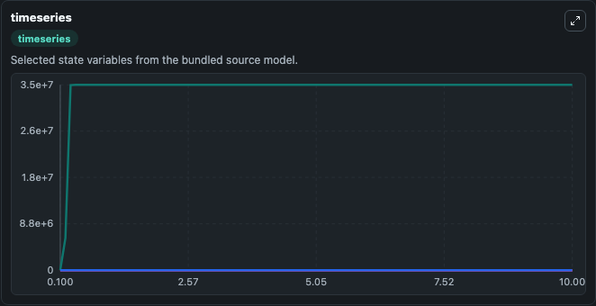
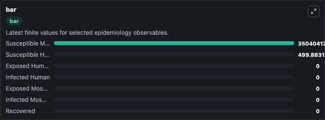
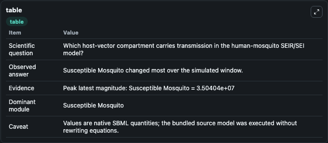

# Turner2015 - Human/Mosquito SEIR/SEI Model

This Biosimulant lab wraps `Turner2015 - Human/Mosquito SEIR/SEI Model` as a runnable epidemiology model with a companion visualization module.
Mathematical model of malaria transmission between humans and mosquitoes. It can be used to explore transmission dynamics and compare scenario outcomes across conditions.

## What You'll See

The lab asks: Which host-vector compartment carries transmission in the human-mosquito SEIR/SEI model? It runs for 10.0 time units with a communication step of 0.1. The run uses the model defaults declared by the curated SBML wrapper. The generated visualizations focus on Exposed Human, Infected Human, Exposed Mosquito, Infected Mosquito, Susceptible Human, and Susceptible Mosquito, and related outputs, combining trajectory, endpoint-comparison, and summary-table views from one completed dark-mode run.

<!-- BIOSIMULANT_VISUALS_START -->
### Output Visualizations



*Time-series view for Turner2015 - Human/Mosquito SEIR/SEI Model, showing selected epidemiology state trajectories across the 10.0 simulation. The card is useful for reading peak timing, depletion, recovery, and persistence across Exposed Human, Infected Human, Exposed Mosquito, Infected Mosquito, Susceptible Human, and Susceptible Mosquito, and related outputs.*



*Latest-value comparison for Turner2015 - Human/Mosquito SEIR/SEI Model, ranking the finite end-of-run values for the selected epidemiology observables. This makes the dominant compartments and residual states easier to compare at the simulation endpoint.*



*Summary table for Turner2015 - Human/Mosquito SEIR/SEI Model, collecting the run diagnostics reported by the visualization model, including duration simulated, observable coverage, largest change, and peak observable when available.*

<!-- BIOSIMULANT_VISUALS_END -->

## Model Context

- Core model: `models/core`
- Visualization model: `models/visualisation`
- Standard: `sbml`
- Upstream source: `biomodels_ebi:MODEL1805220001`
- License: `CC0`

## Inputs

| Input | Maps To | Notes |
|---|---|---|
| Human To Mosquito Transmission | `epidemiology_sbml_turner2015_human_mosquito_seir_sei_model_model1805220001_model.human_to_mosquito_transmission` | Uses the model default unless overridden at run time. |
| Mosquito To Human Transmission | `epidemiology_sbml_turner2015_human_mosquito_seir_sei_model_model1805220001_model.mosquito_to_human_transmission` | Uses the model default unless overridden at run time. |
| Human Recovery Rate | `epidemiology_sbml_turner2015_human_mosquito_seir_sei_model_model1805220001_model.human_recovery_rate` | Uses the model default unless overridden at run time. |
| Mosquito Mortality Rate | `epidemiology_sbml_turner2015_human_mosquito_seir_sei_model_model1805220001_model.mosquito_mortality_rate` | Uses the model default unless overridden at run time. |

## Outputs

| Output | Maps To | Role |
|---|---|---|
| Model state | `state` | Available to the visualization model and downstream workflows. |
| Simulation summary | `summary` | Available to the visualization model and downstream workflows. |
| Species labels | `species_labels` | Available to the visualization model and downstream workflows. |
| Exposed Human | `Exposed_Human` | Available to the visualization model and downstream workflows. |
| Infected Human | `Infected_Human` | Available to the visualization model and downstream workflows. |
| Exposed Mosquito | `Exposed_Mosquito` | Available to the visualization model and downstream workflows. |
| Infected Mosquito | `Infected_Mosquito` | Available to the visualization model and downstream workflows. |
| Susceptible Human | `Susceptible_Human` | Available to the visualization model and downstream workflows. |
| Susceptible Mosquito | `Susceptible_Mosquito` | Available to the visualization model and downstream workflows. |
| Recovered | `Recovered` | Available to the visualization model and downstream workflows. |

## Runtime

- Duration: `10.0`
- Communication step: `0.1`
- Capture run ID: `bd2fad7b-1140-44c4-83ec-533ebce8b534`

## Running Locally

```bash
biosimulant labs serve .
```
