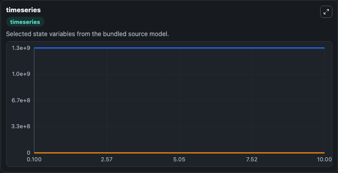
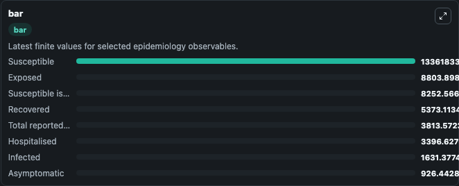
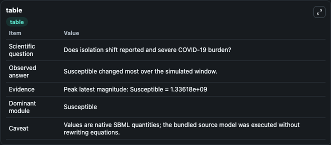

# Wan2020 - risk estimation and prediction of the transmission of COVID-19 in maninland China excluding Hubei province

This Biosimulant lab wraps `Wan2020 - risk estimation and prediction of the transmission of COVID-19 in maninland China excluding Hubei province` as a runnable epidemiology model with a companion visualization module.
Background: In December 2019, an outbreak of coronavirus disease (later named as COVID-19) was identified in Wuhan, China and, later on, detected in other parts of China. It can be used to explore transmission dynamics and compare scenario outcomes across conditions.

## What You'll See

The lab asks: Does isolation shift reported and severe COVID-19 burden? It runs for 10.0 time units with a communication step of 0.1. The run uses the model defaults declared by the curated SBML wrapper. The generated visualizations focus on Recovered from hospitals, Susceptible isolated, Exposed, Infected, Hospitalised, and Deceased, and related outputs, combining trajectory, endpoint-comparison, and summary-table views from one completed dark-mode run.

<!-- BIOSIMULANT_VISUALS_START -->
### Output Visualizations



*Time-series view for Wan2020 - risk estimation and prediction of the transmission of COVID-19 in maninland China excluding Hubei province, showing selected epidemiology state trajectories across the 10.0 simulation. The card is useful for reading peak timing, depletion, recovery, and persistence across Recovered from hospitals, Susceptible isolated, Exposed, Infected, Hospitalised, and Deceased, and related outputs.*



*Latest-value comparison for Wan2020 - risk estimation and prediction of the transmission of COVID-19 in maninland China excluding Hubei province, ranking the finite end-of-run values for the selected epidemiology observables. This makes the dominant compartments and residual states easier to compare at the simulation endpoint.*



*Summary table for Wan2020 - risk estimation and prediction of the transmission of COVID-19 in maninland China excluding Hubei province, collecting the run diagnostics reported by the visualization model, including duration simulated, observable coverage, largest change, and peak observable when available.*

<!-- BIOSIMULANT_VISUALS_END -->

## Model Context

- Core model: `models/core`
- Visualization model: `models/visualisation`
- Standard: `sbml`
- Upstream source: `biomodels_ebi:BIOMD0000000981`
- License: `CC0`

## Inputs

| Input | Maps To | Notes |
|---|---|---|
| Transmission Rate | `epidemiology_sbml_wan2020_risk_estimation_and_prediction_of_the_tr_biomd0000000981_model.transmission_rate` | Uses the model default unless overridden at run time. |

## Outputs

| Output | Maps To | Role |
|---|---|---|
| Model state | `state` | Available to the visualization model and downstream workflows. |
| Simulation summary | `summary` | Available to the visualization model and downstream workflows. |
| Species labels | `species_labels` | Available to the visualization model and downstream workflows. |
| Recovered from hospitals | `Recovered_from_hospitals` | Available to the visualization model and downstream workflows. |
| Susceptible isolated | `Susceptible_isolated` | Available to the visualization model and downstream workflows. |
| Exposed | `Exposed` | Available to the visualization model and downstream workflows. |
| Infected | `Infected` | Available to the visualization model and downstream workflows. |
| Hospitalised | `Hospitalised` | Available to the visualization model and downstream workflows. |
| Deceased | `Deceased` | Available to the visualization model and downstream workflows. |
| Susceptible | `Susceptible` | Available to the visualization model and downstream workflows. |
| Recovered | `Recovered` | Available to the visualization model and downstream workflows. |

## Runtime

- Duration: `10.0`
- Communication step: `0.1`
- Capture run ID: `b47d34e2-e5e3-4dd2-878c-7e6fc4193c0d`

## Running Locally

```bash
biosimulant labs serve .
```
