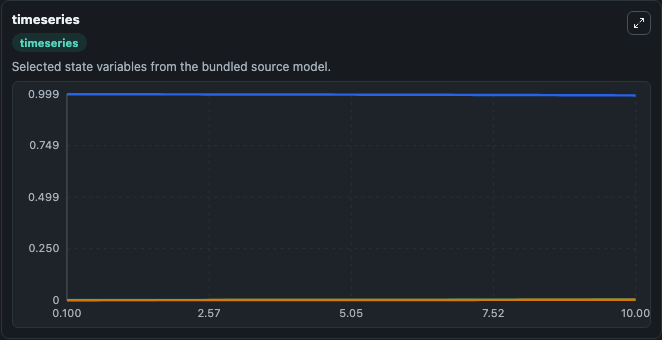
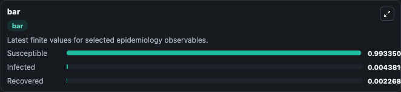
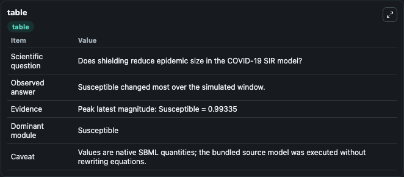

# Weitz2020 - SIR model of COVID-19 transmission with shielding

This Biosimulant lab wraps `Weitz2020 - SIR model of COVID-19 transmission with shielding` as a runnable epidemiology model with a companion visualization module.
The COVID-19 pandemic has precipitated a global crisis, with more than 1,430,000 confirmed cases and more than 85,000 confirmed deaths globally as of 9 April 2020. It can be used to explore transmission dynamics and compare scenario outcomes across conditions.

## What You'll See

The lab asks: Does shielding reduce epidemic size in the COVID-19 SIR model? It runs for 10.0 time units with a communication step of 0.1. The run uses the model defaults declared by the curated SBML wrapper. The generated visualizations focus on Infected, Susceptible, and Recovered, combining trajectory, endpoint-comparison, and summary-table views from one completed dark-mode run.

<!-- BIOSIMULANT_VISUALS_START -->
### Output Visualizations



*Time-series view for Weitz2020 - SIR model of COVID-19 transmission with shielding, showing selected epidemiology state trajectories across the 10.0 simulation. The card is useful for reading peak timing, depletion, recovery, and persistence across Infected, Susceptible, and Recovered.*



*Latest-value comparison for Weitz2020 - SIR model of COVID-19 transmission with shielding, ranking the finite end-of-run values for the selected epidemiology observables. This makes the dominant compartments and residual states easier to compare at the simulation endpoint.*



*Summary table for Weitz2020 - SIR model of COVID-19 transmission with shielding, collecting the run diagnostics reported by the visualization model, including duration simulated, observable coverage, largest change, and peak observable when available.*

<!-- BIOSIMULANT_VISUALS_END -->

## Model Context

- Core model: `models/core`
- Visualization model: `models/visualisation`
- Standard: `sbml`
- Upstream source: `biomodels_ebi:BIOMD0000000963`
- License: `CC0`

## Inputs

| Input | Maps To | Notes |
|---|---|---|
| Transmission Rate | `epidemiology_sbml_weitz2020_sir_model_of_covid_19_transmission_wit_biomd0000000963_model.transmission_rate` | Uses the model default unless overridden at run time. |
| Recovery Rate | `epidemiology_sbml_weitz2020_sir_model_of_covid_19_transmission_wit_biomd0000000963_model.recovery_rate` | Uses the model default unless overridden at run time. |

## Outputs

| Output | Maps To | Role |
|---|---|---|
| Model state | `state` | Available to the visualization model and downstream workflows. |
| Simulation summary | `summary` | Available to the visualization model and downstream workflows. |
| Species labels | `species_labels` | Available to the visualization model and downstream workflows. |
| Infected | `Infected` | Available to the visualization model and downstream workflows. |
| Susceptible | `Susceptible` | Available to the visualization model and downstream workflows. |
| Recovered | `Recovered` | Available to the visualization model and downstream workflows. |

## Runtime

- Duration: `10.0`
- Communication step: `0.1`
- Capture run ID: `bc5db788-2ac0-46dc-be80-633d23cec613`

## Running Locally

```bash
biosimulant labs serve .
```
