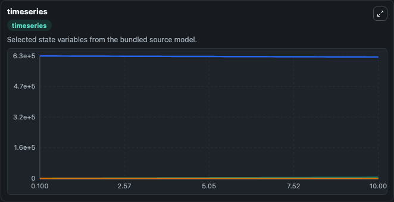
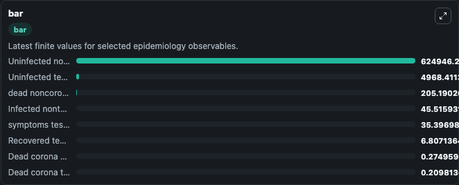
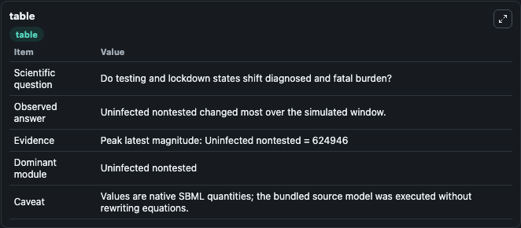

# Westerhoff2020 - systems biology model of the coronavirus pandemic 2020

This Biosimulant lab wraps `Westerhoff2020 - systems biology model of the coronavirus pandemic 2020` as a runnable epidemiology model with a companion visualization module.
Using standard systems biology methodologies a 14-compartment dynamic model was developed for the Corona virus epidemic. The model predicts that: (i) it will be impossible to limit lockdown intensity.

## What You'll See

The lab asks: Do testing and lockdown states shift diagnosed and fatal burden? It runs for 10.0 time units with a communication step of 0.1. The run uses the model defaults declared by the curated SBML wrapper. The generated visualizations focus on Uninfected tested, Uninfected nontested, Infected tested, Infected nontested, Infected tested div10, and Dead corona tested, and related outputs, combining trajectory, endpoint-comparison, and summary-table views from one completed dark-mode run.

<!-- BIOSIMULANT_VISUALS_START -->
### Output Visualizations



*Time-series view for Westerhoff2020 - systems biology model of the coronavirus pandemic 2020, showing selected epidemiology state trajectories across the 10.0 simulation. The card is useful for reading peak timing, depletion, recovery, and persistence across Uninfected tested, Uninfected nontested, Infected tested, Infected nontested, Infected tested div10, and Dead corona tested, and related outputs.*



*Latest-value comparison for Westerhoff2020 - systems biology model of the coronavirus pandemic 2020, ranking the finite end-of-run values for the selected epidemiology observables. This makes the dominant compartments and residual states easier to compare at the simulation endpoint.*



*Summary table for Westerhoff2020 - systems biology model of the coronavirus pandemic 2020, collecting the run diagnostics reported by the visualization model, including duration simulated, observable coverage, largest change, and peak observable when available.*

<!-- BIOSIMULANT_VISUALS_END -->

## Model Context

- Core model: `models/core`
- Visualization model: `models/visualisation`
- Standard: `sbml`
- Upstream source: `biomodels_ebi:BIOMD0000000988`
- License: `CC0`

## Inputs

| Input | Maps To | Notes |
|---|---|---|
| Social Distance | `epidemiology_sbml_westerhoff2020_systems_biology_model_of_the_coro_biomd0000000988_model.social_distance` | Uses the model default unless overridden at run time. |
| Lockdown Severity | `epidemiology_sbml_westerhoff2020_systems_biology_model_of_the_coro_biomd0000000988_model.lockdown_severity` | Uses the model default unless overridden at run time. |
| Random Testing Rate | `epidemiology_sbml_westerhoff2020_systems_biology_model_of_the_coro_biomd0000000988_model.random_testing_rate` | Uses the model default unless overridden at run time. |
| Symptom Testing Rate | `epidemiology_sbml_westerhoff2020_systems_biology_model_of_the_coro_biomd0000000988_model.symptom_testing_rate` | Uses the model default unless overridden at run time. |

## Outputs

| Output | Maps To | Role |
|---|---|---|
| Model state | `state` | Available to the visualization model and downstream workflows. |
| Simulation summary | `summary` | Available to the visualization model and downstream workflows. |
| Species labels | `species_labels` | Available to the visualization model and downstream workflows. |
| Uninfected tested | `uninfected_tested_0` | Available to the visualization model and downstream workflows. |
| Uninfected nontested | `uninfected_nontested_0` | Available to the visualization model and downstream workflows. |
| Infected tested | `infected_tested_0` | Available to the visualization model and downstream workflows. |
| Infected nontested | `infected_nontested_0` | Available to the visualization model and downstream workflows. |
| Infected tested div10 | `infected_tested_div10` | Available to the visualization model and downstream workflows. |
| Dead corona tested | `dead_corona_tested_0` | Available to the visualization model and downstream workflows. |
| Dead corona nontested | `dead_corona_nontested_0` | Available to the visualization model and downstream workflows. |
| Recovered tested | `recovered_tested_0` | Available to the visualization model and downstream workflows. |

## Runtime

- Duration: `10.0`
- Communication step: `0.1`
- Capture run ID: `bfe96cf2-9270-4182-9d19-a457e3fdc860`

## Running Locally

```bash
biosimulant labs serve .
```
