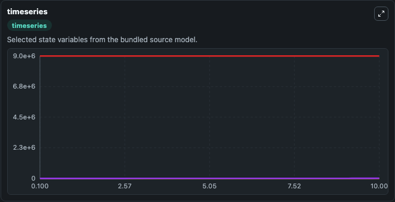
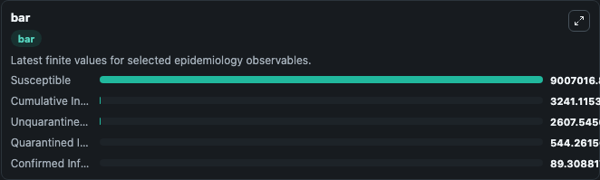
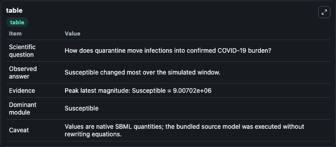

# Zhao2020 - SUQC model of COVID-19 transmission dynamics in Wuhan, Hubei, and China

This Biosimulant lab wraps `Zhao2020 - SUQC model of COVID-19 transmission dynamics in Wuhan, Hubei, and China` as a runnable epidemiology model with a companion visualization module.
Background - The coronavirus disease 2019 (COVID-19) is rapidly spreading in China and more than 30 countries over last two months. COVID-19 has multiple characteristics distinct from other infectious.

## What You'll See

The lab asks: How does quarantine move infections into confirmed COVID-19 burden? It runs for 10.0 time units with a communication step of 0.1. The run uses the model defaults declared by the curated SBML wrapper. The generated visualizations focus on Unquarantined Infected, Quarantined Infected, Confirmed Infected, Cumulative Infected, and Susceptible, combining trajectory, endpoint-comparison, and summary-table views from one completed dark-mode run.

<!-- BIOSIMULANT_VISUALS_START -->
### Output Visualizations



*Time-series view for Zhao2020 - SUQC model of COVID-19 transmission dynamics in Wuhan, Hubei, and China, showing selected epidemiology state trajectories across the 10.0 simulation. The card is useful for reading peak timing, depletion, recovery, and persistence across Unquarantined Infected, Quarantined Infected, Confirmed Infected, Cumulative Infected, and Susceptible.*



*Latest-value comparison for Zhao2020 - SUQC model of COVID-19 transmission dynamics in Wuhan, Hubei, and China, ranking the finite end-of-run values for the selected epidemiology observables. This makes the dominant compartments and residual states easier to compare at the simulation endpoint.*



*Summary table for Zhao2020 - SUQC model of COVID-19 transmission dynamics in Wuhan, Hubei, and China, collecting the run diagnostics reported by the visualization model, including duration simulated, observable coverage, largest change, and peak observable when available.*

<!-- BIOSIMULANT_VISUALS_END -->

## Model Context

- Core model: `models/core`
- Visualization model: `models/visualisation`
- Standard: `sbml`
- Upstream source: `biomodels_ebi:BIOMD0000000962`
- License: `CC0`

## Inputs

| Input | Maps To | Notes |
|---|---|---|
| Reproduction Number | `epidemiology_sbml_zhao2020_suqc_model_of_covid_19_transmission_dyn_biomd0000000962_model.reproduction_number` | Uses the model default unless overridden at run time. |
| Transmission Rate | `epidemiology_sbml_zhao2020_suqc_model_of_covid_19_transmission_dyn_biomd0000000962_model.transmission_rate` | Uses the model default unless overridden at run time. |
| Incubation Rate | `epidemiology_sbml_zhao2020_suqc_model_of_covid_19_transmission_dyn_biomd0000000962_model.incubation_rate` | Uses the model default unless overridden at run time. |

## Outputs

| Output | Maps To | Role |
|---|---|---|
| Model state | `state` | Available to the visualization model and downstream workflows. |
| Simulation summary | `summary` | Available to the visualization model and downstream workflows. |
| Species labels | `species_labels` | Available to the visualization model and downstream workflows. |
| Unquarantined Infected | `Unquarantined_Infected` | Available to the visualization model and downstream workflows. |
| Quarantined Infected | `Quarantined_Infected` | Available to the visualization model and downstream workflows. |
| Confirmed Infected | `Confirmed_Infected` | Available to the visualization model and downstream workflows. |
| Cumulative Infected | `Cumulative_Infected` | Available to the visualization model and downstream workflows. |
| Susceptible | `Susceptible` | Available to the visualization model and downstream workflows. |

## Runtime

- Duration: `10.0`
- Communication step: `0.1`
- Capture run ID: `40f03543-a7a9-4d5f-ac1f-1dd5f690e497`

## Running Locally

```bash
biosimulant labs serve .
```
