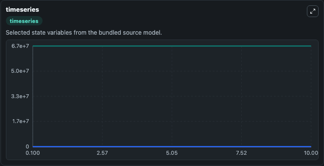
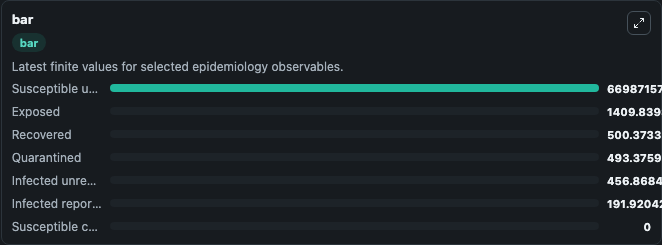
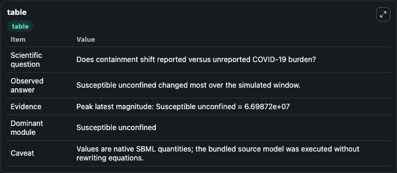

# Zongo2020 - model of COVID-19 transmission dynamics under containment measures in France

This Biosimulant lab wraps `Zongo2020 - model of COVID-19 transmission dynamics under containment measures in France` as a runnable epidemiology model with a companion visualization module.
The main objective of this paper is to address the following question: are the containment measures imposed by most of the world governments effective and sufficient to stop the epidemic of COVID-19 b. It can be used to explore transmission dynamics and compare scenario outcomes across conditions.

## What You'll See

The lab asks: Does containment shift reported versus unreported COVID-19 burden? It runs for 10.0 time units with a communication step of 0.1. The run uses the model defaults declared by the curated SBML wrapper. The generated visualizations focus on Susceptible unconfined, Infected unreported, Susceptible confined, Exposed, Infected reported, and Recovered, and related outputs, combining trajectory, endpoint-comparison, and summary-table views from one completed dark-mode run.

<!-- BIOSIMULANT_VISUALS_START -->
### Output Visualizations



*Time-series view for Zongo2020 - model of COVID-19 transmission dynamics under containment measures in France, showing selected epidemiology state trajectories across the 10.0 simulation. The card is useful for reading peak timing, depletion, recovery, and persistence across Susceptible unconfined, Infected unreported, Susceptible confined, Exposed, Infected reported, and Recovered, and related outputs.*



*Latest-value comparison for Zongo2020 - model of COVID-19 transmission dynamics under containment measures in France, ranking the finite end-of-run values for the selected epidemiology observables. This makes the dominant compartments and residual states easier to compare at the simulation endpoint.*



*Summary table for Zongo2020 - model of COVID-19 transmission dynamics under containment measures in France, collecting the run diagnostics reported by the visualization model, including duration simulated, observable coverage, largest change, and peak observable when available.*

<!-- BIOSIMULANT_VISUALS_END -->

## Model Context

- Core model: `models/core`
- Visualization model: `models/visualisation`
- Standard: `sbml`
- Upstream source: `biomodels_ebi:BIOMD0000000983`
- License: `CC0`

## Inputs

| Input | Maps To | Notes |
|---|---|---|
| Transmission Probability | `epidemiology_sbml_zongo2020_model_of_covid_19_transmission_dynamic_biomd0000000983_model.transmission_probability` | Uses the model default unless overridden at run time. |
| Incubation Rate | `epidemiology_sbml_zongo2020_model_of_covid_19_transmission_dynamic_biomd0000000983_model.incubation_rate` | Uses the model default unless overridden at run time. |
| Containment Quarantine Rate | `epidemiology_sbml_zongo2020_model_of_covid_19_transmission_dynamic_biomd0000000983_model.containment_quarantine_rate` | Uses the model default unless overridden at run time. |
| Confinement Fraction | `epidemiology_sbml_zongo2020_model_of_covid_19_transmission_dynamic_biomd0000000983_model.confinement_fraction` | Uses the model default unless overridden at run time. |
| Unreported Infection Fraction | `epidemiology_sbml_zongo2020_model_of_covid_19_transmission_dynamic_biomd0000000983_model.unreported_infection_fraction` | Uses the model default unless overridden at run time. |

## Outputs

| Output | Maps To | Role |
|---|---|---|
| Model state | `state` | Available to the visualization model and downstream workflows. |
| Simulation summary | `summary` | Available to the visualization model and downstream workflows. |
| Species labels | `species_labels` | Available to the visualization model and downstream workflows. |
| Susceptible unconfined | `S_u` | Available to the visualization model and downstream workflows. |
| Infected unreported | `I_u` | Available to the visualization model and downstream workflows. |
| Susceptible confined | `S_c` | Available to the visualization model and downstream workflows. |
| Exposed | `E` | Available to the visualization model and downstream workflows. |
| Infected reported | `I_r` | Available to the visualization model and downstream workflows. |
| Recovered | `R` | Available to the visualization model and downstream workflows. |
| Quarantined | `Q` | Available to the visualization model and downstream workflows. |

## Runtime

- Duration: `10.0`
- Communication step: `0.1`
- Capture run ID: `6798f259-1a46-4f60-a20b-7762ae68280b`

## Running Locally

```bash
biosimulant labs serve .
```
